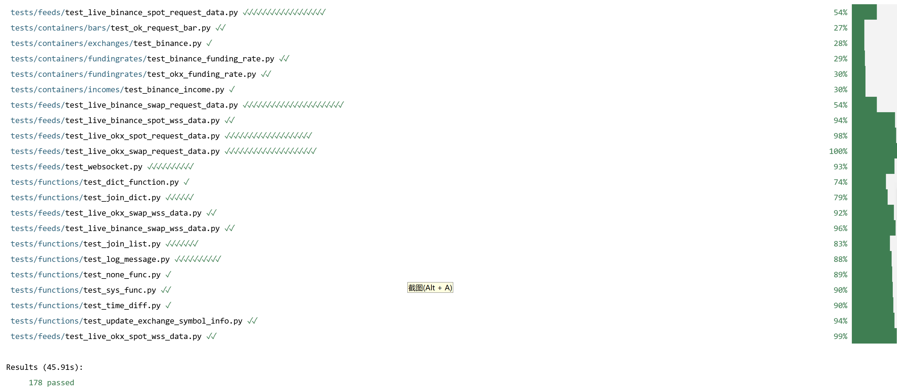

# bt_api_py

#### introduction
This is a Python package that integrates with Binance and OKX for spot and contract trading, offering three types of API interfaces: standard mode, asynchronous mode, and WebSocket mode.

#### how to install

- directly install from pypi:

`pip install bt_api_py`

- or clone the project and install from source:
``` bash
git clone https://github.com/cloudQuant/bt_api_py
pip install -r ./bt_api_py/requirements.txt
pip install ./bt_api_py/
```

#### run tests
- First, create an `account_config.yaml` file in the `btpy/configs` folder to configure account information.  
  - Refer to the format in `account_config_example.yaml`.  
  - To successfully run the tests, you will need APIs for Binance and OKX exchanges, and ensure there are at least 10 USDT in both the spot and contract accounts.  
  - You usually need to add your IP address to the exchange's whitelist in order to use it for trading.
- In the `bt_api_py` folder, run the following commands:  
  - `pytest tests -n 4`  # Run tests using 4 CPUs.  
  - `pytest tests -n 4 --picked`  # Use 4 CPUs to only test new or previously failed tests.

- run tests result

####  how to use

This is a part of btpy package, which is used to high frequency trading and market making.
now, it aims to integrate with backtrader and let backtrader can trade crypto.

