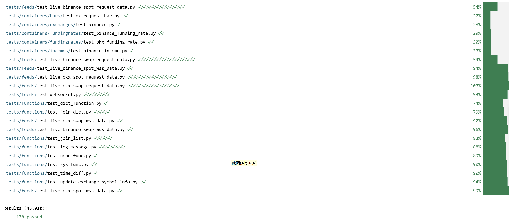

# bt_api_py

[](https://www.python.org/downloads/)
[](https://opensource.org/licenses/MIT)
[](https://pypi.org/project/bt_api_py/)

**bt_api_py** 是一个统一的多交易所交易 API 框架，支持现货、合约、期货等多种交易类型，提供同步、异步和 WebSocket 三种接口模式。

[English](README.en.md) | 中文

---

## 特性

- **多交易所统一接口** — 通过 `BtApi` 类统一管理 Binance、OKX、CTP(中国期货)、Interactive Brokers 等交易所
- **三种 API 模式** — 同步 REST、异步 REST、WebSocket 实时推送
- **即插即用架构** — 基于 Registry 模式，新增交易所无需修改核心代码
- **事件驱动** — 内置 EventBus 事件总线，支持回调模式
- **丰富的数据容器** — 标准化的 Ticker、OrderBook、Bar、Order、Position 等 20+ 种数据类型
- **跨平台** — 支持 Linux (x86_64)、Windows (x64)、macOS (arm64/x86_64)

## 支持的交易所

| 交易所 | 现货 (SPOT) | 合约 (SWAP) | 期货 (FUTURE) | 股票 (STK) |
|--------|:-----------:|:-----------:|:-------------:|:----------:|
| **Binance** | ✅ | ✅ | — | — |
| **OKX** | ✅ | ✅ | — | — |
| **CTP** (中国期货) | — | — | ✅ | — |
| **Interactive Brokers** | — | — | — | ✅ |
| **IB Web API** | — | — | — | ✅ |

## 安装

### 从 PyPI 安装

```bash
pip install bt_api_py
```

### 从源码安装

```bash
git clone https://github.com/cloudQuant/bt_api_py
cd bt_api_py
pip install -r requirements.txt
pip install .
```

### 安装开发依赖

```bash
pip install -e ".[dev]"
```

## 快速开始

### 1. 配置账户

复制示例配置文件并填入你的 API 密钥：

```bash
cp bt_api_py/configs/account_config_example.yaml bt_api_py/configs/account_config.yaml
```

配置文件格式：

```yaml
binance:
  public_key: 'YOUR_API_KEY'
  private_key: 'YOUR_SECRET_KEY'

okx:
  public_key: 'YOUR_API_KEY'
  private_key: 'YOUR_SECRET_KEY'
  passphrase: 'YOUR_PASSPHRASE'
```

### 2. 初始化并连接交易所

```python
from bt_api_py.bt_api import BtApi

# 定义交易所连接参数
exchange_kwargs = {
    "BINANCE___SWAP": {
        "public_key": "YOUR_API_KEY",
        "private_key": "YOUR_SECRET_KEY",
    },
    "OKX___SWAP": {
        "public_key": "YOUR_API_KEY",
        "private_key": "YOUR_SECRET_KEY",
        "passphrase": "YOUR_PASSPHRASE",
    },
}

# 创建统一 API 实例
bt_api = BtApi(exchange_kwargs, debug=True)
```

### 3. REST 同步请求

```python
# 获取行情
api = bt_api.get_request_api("BINANCE___SWAP")
tick = api.get_tick("BTC-USDT")

# 获取K线
kline = api.get_kline("BTC-USDT", "1m", count=100)

# 下单
order = api.make_order("BTC-USDT", volume=0.001, price=50000.0, order_type="limit")

# 查询余额
balance = api.get_balance()
```

### 4. WebSocket 实时订阅

```python
# 订阅行情
bt_api.subscribe("BINANCE___SWAP___BTC-USDT", [
    {"topic": "kline", "symbol": "BTC-USDT", "period": "1m"},
    {"topic": "depth", "symbol": "BTC-USDT"},
])

# 从数据队列获取推送数据
data_queue = bt_api.get_data_queue("BINANCE___SWAP")
while True:
    data = data_queue.get(timeout=10)
    data.init_data()
    print(data)
```

### 5. 异步请求

```python
# 异步方法将结果推送到数据队列
api.async_get_tick("BTC-USDT", extra_data={"key": "value"})
data = data_queue.get(timeout=10)
```

## 项目结构

```
bt_api_py/
├── bt_api_py/                  # 核心包
│   ├── bt_api.py               # 统一 API 入口
│   ├── registry.py             # 交易所注册表
│   ├── event_bus.py            # 事件总线
│   ├── auth_config.py          # 认证配置
│   ├── exceptions.py           # 异常体系
│   ├── containers/             # 数据容器 (20+ 种类型)
│   │   ├── orders/             # 订单数据
│   │   ├── tickers/            # 行情数据
│   │   ├── bars/               # K线数据
│   │   ├── orderbooks/         # 深度数据
│   │   ├── positions/          # 持仓数据
│   │   └── ...
│   ├── feeds/                  # 交易所适配层
│   │   ├── abstract_feed.py    # 统一场所协议
│   │   ├── base_stream.py      # 流式数据基类
│   │   ├── live_binance/       # Binance 实现
│   │   ├── live_okx/           # OKX 实现
│   │   └── register_*.py       # 交易所注册模块
│   └── ctp/                    # CTP 期货专用模块
├── docs/                       # 文档
├── tests/                      # 测试
├── configs/                    # 配置文件
└── examples/                   # 示例代码
```

## 文档

- [架构设计](docs/architecture.md) — 核心架构、设计模式、数据流
- [API 使用指南](docs/usage_guide.md) — 完整的使用教程和示例
- [开发者指南](docs/developer_guide.md) — 如何扩展和贡献代码
- [更新日志](docs/change_log.md) — 版本变更记录
- [文档索引](docs/index.md) — 所有文档的导航入口

### 交易所 API 参考

- [Binance API](docs/binance/) — Binance 现货/合约 API 文档
- [OKX API](docs/okx/) — OKX 全品类 API 文档
- [IB Web API](docs/ib_web_api/) — Interactive Brokers Web API 文档

## 运行测试

1. 创建 `bt_api_py/configs/account_config.yaml` 配置文件（参考 `account_config_example.yaml`）
2. 确保 Binance 和 OKX 的现货和合约账户中各有至少 10 USDT
3. 将你的 IP 地址添加到交易所的 API 白名单中

```bash
# 使用 4 个 CPU 并行运行所有测试
pytest tests -n 4

# 仅运行新增或上次失败的测试
pytest tests -n 4 --picked
```



## 许可证

本项目采用 [MIT License](https://opensource.org/licenses/MIT) 开源许可。

## 作者

[cloudQuant](https://github.com/cloudQuant) — yunjinqi@gmail.com
