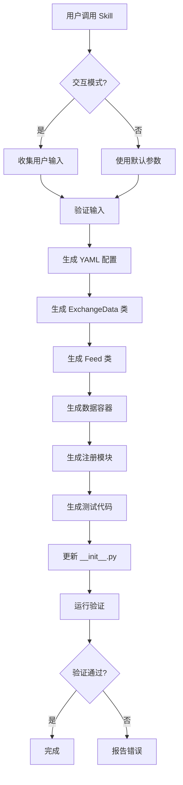

# 交易所集成自动化 Skill 设计文档

## 目录
1. [概述](#概述)
2. [核心模式分析](#核心模式分析)
3. [认证机制](#认证机制)
4. [WebSocket 实现](#websocket-实现)
5. [数据容器](#数据容器)
6. [限流机制](#限流机制)
7. [错误处理](#错误处理)
8. [Skill 实现](#skill-实现)
9. [模板系统](#模板系统)
10. [验证策略](#验证策略)

---

## 概述

### 目标
创建一个自动化 Skill，用于快速生成标准化交易所集成代码，支持 70+ 交易所的对接。

### 设计原则
1. **约定优于配置** - 遵循现有代码模式
2. **最小惊讶原则** - 生成代码与手写代码一致
3. **渐进式增强** - 支持基础版 + 高级功能扩展
4. **可测试性** - 自动生成测试代码

---

## 核心模式分析

### 1. 继承层次

```
                    ┌─────────────────┐
                    │  AbstractVenueFeed (Protocol) │
                    └────────┬────────┘
                             │
                    ┌────────▼────────┐
                    │      Feed       │ ← HTTP 交易所基类
                    │  (AsyncBase)    │
                    │  (ConnectionMixin) │
                    │  (CapabilityMixin) │
                    └────────┬────────┘
                             │
        ┌────────────────────┼────────────────────┐
        │                    │                    │
┌───────▼───────┐   ┌───────▼───────┐   ┌───────▼───────┐
│  Binance*     │   │     OKX*      │   │   NewExchange │
│  RequestData  │   │  RequestData  │   │  RequestData  │
└───────────────┘   └───────────────┘   └───────────────┘
```

### 2. 文件组织模式

```
bt_api_py/
├── feeds/
│   ├── live_{exchange}/              # 交易所包目录
│   │   ├── __init__.py
│   │   ├── request_base.py           # REST 基类 (可选)
│   │   ├── {asset_type}.py           # 资产类型实现
│   │   ├── market_wss_base.py        # 行情流基类
│   │   ├── account_wss_base.py       # 账户流基类
│   │   └── mixins/                   # 功能模块 (可选)
│   └── register_{exchange}.py        # 注册模块
├── containers/
│   ├── exchanges/
│   │   └── {exchange}_exchange_data.py
│   ├── tickers/
│   │   └── {exchange}_ticker.py
│   ├── orders/
│   │   └── {exchange}_order.py
│   └── ...
└── configs/
    └── {exchange}.yaml
```

### 3. 注册模式

```python
# feeds/register_{exchange}.py
from bt_api_py.registry import ExchangeRegistry

def register_{exchange}():
    # 注册 Feed 类
    ExchangeRegistry.register_feed(
        "{EXCHANGE}___{ASSET_TYPE}",
        {Exchange}RequestData{AssetType}
    )

    # 注册配置类
    ExchangeRegistry.register_exchange_data(
        "{EXCHANGE}___{ASSET_TYPE}",
        {Exchange}ExchangeData{AssetType}
    )

    # 注册流处理器
    ExchangeRegistry.register_stream(
        "{EXCHANGE}___{ASSET_TYPE}",
        "subscribe",
        _{exchange}_subscribe_handler
    )

    # 注册余额处理器
    ExchangeRegistry.register_balance_handler(
        "{EXCHANGE}___{ASSET_TYPE}",
        _{exchange}_balance_handler
    )
```

---

## 认证机制

### 支持的认证类型

| 类型 | 参数 | 签名方式 | Header |
|------|------|----------|--------|
| **HMAC-SHA256** | api_key, secret | query param | `X-MBX-APIKEY` |
| **HMAC-SHA256+Passphrase** | api_key, secret, passphrase | header | 多个自定义 header |
| **API Key Only** | api_key | 无 | `Authorization: Bearer {key}` |
| **OAuth 2.0** | access_token | 无 | `Authorization: Bearer {token}` |
| **Broker Auth** | broker_id, user_id, password | 协议级 | N/A |

### 认证模板

```python
# 模板: auth_methods.py

class HmacSha256Auth:
    """HMAC-SHA256 签名认证 (Binance 风格)"""

    def __init__(self, api_key: str, secret_key: str):
        self.api_key = api_key
        self.secret_key = secret_key

    def sign(self, params: dict) -> str:
        """签名查询参数"""
        import hmac
        import urllib.parse

        params["timestamp"] = int(time.time() * 1000)
        query = urllib.parse.urlencode(params)
        signature = hmac.new(
            self.secret_key.encode("utf-8"),
            query.encode("utf-8"),
            digestmod="sha256"
        ).hexdigest()
        params["signature"] = signature
        return query

    def get_headers(self) -> dict:
        return {"X-MBX-APIKEY": self.api_key}


class HmacSha256PassphraseAuth:
    """HMAC-SHA256 + Passphrase 认证 (OKX 风格)"""

    def __init__(self, api_key: str, secret_key: str, passphrase: str):
        self.api_key = api_key
        self.secret_key = secret_key
        self.passphrase = passphrase

    def sign(self, timestamp: str, method: str, path: str, body: str = "") -> str:
        """签名请求"""
        import hmac
        import base64

        message = timestamp + method.upper() + path + body
        mac = hmac.new(
            self.secret_key.encode("utf-8"),
            message.encode("utf-8"),
            digestmod="sha256"
        )
        return base64.b64encode(mac.digest()).decode()

    def get_headers(self, timestamp: str, method: str, path: str, body: str = "") -> dict:
        sign = self.sign(timestamp, method, path, body)
        return {
            "OK-ACCESS-KEY": self.api_key,
            "OK-ACCESS-SIGN": sign,
            "OK-ACCESS-TIMESTAMP": timestamp,
            "OK-ACCESS-PASSPHRASE": self.passphrase,
        }
```

---

## WebSocket 实现

### WebSocket 类型对比

| 类型 | 连接方式 | 认证 | 订阅格式 | 心跳 |
|------|----------|------|----------|------|
| **Binance** | 直接连接 | listenKey | `{"method": "SUBSCRIBE", "params": [...]}` | 无显式 ping |
| **OKX** | 登录后订阅 | login 消息 | `{"op": "subscribe", "args": [...]}` | 内置 |
| **Generic** | 标准 WS | header | JSON 格式 | ping/pong |

### WebSocket 模板

```python
# 模板: websocket_stream.py

import json
import time
import threading
import websocket
from bt_api_py.feeds.base_stream import BaseDataStream

class GenericMarketStream(BaseDataStream):
    """通用行情 WebSocket 流"""

    def __init__(self, data_queue, **kwargs):
        super().__init__(data_queue, **kwargs)
        self.exchange_data = kwargs["exchange_data"]
        self.wss_url = self.exchange_data.wss_url
        self.topics = kwargs.get("topics", {})
        self.ws = None
        self._running = False
        self._thread = None

    def connect(self):
        """建立 WebSocket 连接"""
        self.ws = websocket.WebSocketApp(
            self.wss_url,
            on_message=self.on_message,
            on_error=self.on_error,
            on_close=self.on_close,
            on_open=self.on_open
        )
        self._running = True
        self._thread = threading.Thread(target=self.ws.run_forever)
        self._thread.daemon = True
        self._thread.start()

    def subscribe_topics(self, topics):
        """订阅主题"""
        for topic in topics:
            symbol = topic.get("symbol", "")
            topic_type = topic.get("type", "ticker")
            msg = self._build_subscribe_msg(symbol, topic_type)
            self.ws.send(msg)

    def _build_subscribe_msg(self, symbol: str, topic_type: str) -> str:
        """构建订阅消息"""
        path = self.exchange_data.get_wss_path(topic=topic_type, symbol=symbol)
        return path

    def on_message(self, ws, message):
        """处理接收的消息"""
        try:
            data = json.loads(message)
            container = self._parse_message(data)
            if container:
                self.data_queue.put(container)
        except Exception as e:
            self.logger.error(f"Parse message error: {e}")

    def on_open(self, ws):
        """连接建立后订阅"""
        if self.topics:
            self.subscribe_topics(self.topics.get("market", []))

    def on_error(self, ws, error):
        """错误处理"""
        self.logger.error(f"WebSocket error: {error}")

    def on_close(self, ws, close_status_code, close_msg):
        """连接关闭处理"""
        self.logger.warning(f"WebSocket closed: {close_status_code}")

    def disconnect(self):
        """断开连接"""
        self._running = False
        if self.ws:
            self.ws.close()
```

---

## 数据容器

### 容器接口要求

```python
# 基础容器接口
class TickerData:
    """行情数据容器基类"""

    def __init__(self, ticker_info, symbol_name, asset_type, has_been_json_encoded=False):
        self.ticker_info = ticker_info
        self.has_been_json_encoded = has_been_json_encoded
        self.symbol_name = symbol_name
        self.asset_type = asset_type
        self.has_been_init_data = False

    # 必须实现的抽象方法
    def init_data(self):
        """解析原始数据，提取字段"""
        raise NotImplementedError

    # 标准接口方法
    def get_exchange_name(self) -> str: ...
    def get_symbol_name(self) -> str: ...
    def get_ticker_symbol_name(self) -> str: ...
    def get_asset_type(self) -> str: ...
    def get_server_time(self) -> float: ...
    def get_bid_price(self) -> float | None: ...
    def get_ask_price(self) -> float | None: ...
    def get_bid_volume(self) -> float | None: ...
    def get_ask_volume(self) -> float | None: ...
    def get_last_price(self) -> float | None: ...
    def get_last_volume(self) -> float | None: ...
```

### 容器模板

```python
# 模板: ticker_container.py

import json
import time
from bt_api_py.containers.tickers.ticker import TickerData
from bt_api_py.functions.utils import from_dict_get_float, from_dict_get_string

class {Exchange}TickerData(TickerData):
    """{Exchange} 行情数据容器"""

    def __init__(self, ticker_info, symbol_name, asset_type, has_been_json_encoded=False):
        super().__init__(ticker_info, symbol_name, asset_type, has_been_json_encoded)
        self.exchange_name = "{EXCHANGE}"
        self.local_update_time = time.time()
        self.ticker_data = ticker_info if has_been_json_encoded else None
        self.ticker_symbol_name = None
        self.server_time = None
        self.bid_price = None
        self.ask_price = None
        self.bid_volume = None
        self.ask_volume = None
        self.last_price = None
        self.last_volume = None

    def init_data(self):
        """解析 {Exchange} ticker 响应"""
        if not self.has_been_json_encoded:
            self.ticker_data = json.loads(self.ticker_info)
            self.has_been_json_encoded = True
        if self.has_been_init_data:
            return self

        # 根据 {Exchange} API 文档映射字段
        # REST API 字段
        self.ticker_symbol_name = from_dict_get_string(self.ticker_data, "{rest_symbol_field}")
        self.server_time = from_dict_get_float(self.ticker_data, "{rest_time_field}")
        self.bid_price = from_dict_get_float(self.ticker_data, "{rest_bid_field}")
        self.ask_price = from_dict_get_float(self.ticker_data, "{rest_ask_field}")
        self.bid_volume = from_dict_get_float(self.ticker_data, "{rest_bid_qty_field}")
        self.ask_volume = from_dict_get_float(self.ticker_data, "{rest_ask_qty_field}")
        self.last_price = from_dict_get_float(self.ticker_data, "{rest_last_field}")
        self.last_volume = from_dict_get_float(self.ticker_data, "{rest_last_qty_field}")

        self.has_been_init_data = True
        return self


class {Exchange}WssTickerData({Exchange}TickerData):
    """{Exchange} WebSocket 行情数据容器"""

    def init_data(self):
        """解析 {Exchange} WebSocket ticker 响应"""
        if not self.has_been_json_encoded:
            self.ticker_data = json.loads(self.ticker_info)
            self.has_been_json_encoded = True
        if self.has_been_init_data:
            return self

        # WebSocket API 字段 (可能不同)
        self.ticker_symbol_name = from_dict_get_string(self.ticker_data, "{wss_symbol_field}")
        self.server_time = from_dict_get_float(self.ticker_data, "{wss_time_field}")
        self.bid_price = from_dict_get_float(self.ticker_data, "{wss_bid_field}")
        self.ask_price = from_dict_get_float(self.ticker_data, "{wss_ask_field}")
        self.bid_volume = from_dict_get_float(self.ticker_data, "{wss_bid_qty_field}")
        self.ask_volume = from_dict_get_float(self.ticker_data, "{wss_ask_qty_field}")
        self.last_price = from_dict_get_float(self.ticker_data, "{wss_last_field}")
        self.last_volume = from_dict_get_float(self.ticker_data, "{wss_last_qty_field}")

        self.has_been_init_data = True
        return self
```

### 字段映射配置

```yaml
# configs/{exchange}.yaml 中添加字段映射
field_mappings:
  ticker:
    rest:
      symbol: "symbol"      # REST API 中的 symbol 字段
      time: "time"          # 时间戳字段
      bid: "bidPrice"       # 买价字段
      ask: "askPrice"       # 卖价字段
      bid_qty: "bidQty"     # 买量字段
      ask_qty: "askQty"     # 卖量字段
      last: "lastPrice"     # 最新价字段
      last_qty: "lastQty"   # 最新量字段
    wss:
      symbol: "s"           # WebSocket 中的 symbol 字段
      time: "E"             # 时间戳字段
      bid: "b"              # 买价字段
      ask: "a"              # 卖价字段
      bid_qty: "B"          # 买量字段
      ask_qty: "A"          # 卖量字段
      last: "c"             # 最新价字段
      last_qty: "Q"         # 最新量字段
```

---

## 限流机制

### 限流规则配置

```yaml
# configs/{exchange}.yaml
rate_limits:
  - name: global_weight
    type: sliding_window
    interval: 60
    limit: 1200
    scope: global
    weight: 1

  - name: order_rate
    type: sliding_window
    interval: 10
    limit: 100
    scope: endpoint
    endpoint: "/api/v1/order*"
    weight_map:
      POST: 10
      DELETE: 5
      GET: 1

  - name: market_data
    type: fixed_window
    interval: 1
    limit: 300
    scope: endpoint
    endpoint: "/api/v1/ticker*"
```

### 限流器使用

```python
from bt_api_py.rate_limiter import (
    RateLimiter,
    RateLimitRule,
    RateLimitType,
    RateLimitScope
)

class {Exchange}RequestData(Feed):
    def _create_default_rate_limiter(self):
        rules = [
            RateLimitRule(
                name="global",
                type=RateLimitType.SLIDING_WINDOW,
                interval=60,
                limit=1200,
                scope=RateLimitScope.GLOBAL
            ),
            # 从配置加载更多规则...
        ]
        return RateLimiter(rules)
```

---

## 错误处理

### 错误翻译器

```python
# 模板: error_translator.py

from bt_api_py.error_framework import ErrorTranslator

class {Exchange}ErrorTranslator(ErrorTranslator):
    """{Exchange} 错误翻译器"""

    # 错误码映射
    ERROR_CODE_MAP = {
        "10001": "rate_limit_exceeded",
        "10002": "invalid_signature",
        "10003": "insufficient_balance",
        "10004": "order_not_found",
        "10005": "symbol_not_found",
    }

    def translate(self, raw_response, exchange_name):
        """翻译 {Exchange} 错误到统一格式"""
        if not isinstance(raw_response, dict):
            return None

        # 检查错误码
        code = raw_response.get("code") or raw_response.get("sCode")
        if code and str(code) != "0":
            error_type = self.ERROR_CODE_MAP.get(str(code), "unknown_error")
            message = raw_response.get("msg") or raw_response.get("sMsg")

            return UnifiedError(
                exchange=exchange_name,
                code=code,
                type=error_type,
                message=message,
                raw=raw_response
            )

        return None
```

---

## Skill 实现

### Skill 元数据

```yaml
---
name: exchange-integration
description: "Generate standardized cryptocurrency exchange integrations for bt_api_py"
version: "1.0.0"
author: "bt_api_py"

requires:
  python: ">=3.8"
  templates: true

inputs:
  exchange_name:
    type: string
    required: true
    description: "Exchange name (e.g., 'bybit', 'kucoin')"

  asset_types:
    type: list
    required: true
    description: "Asset types to implement (spot, futures, swap, margin)"
    default: ["spot"]

  auth_type:
    type: string
    required: true
    description: "Authentication method"
    choices:
      - hmac_sha256
      - hmac_sha256_passphrase
      - api_key
      - oauth2
    default: "hmac_sha256"

  rest_url:
    type: string
    required: true
    description: "REST API base URL"

  wss_url:
    type: string
    required: false
    description: "WebSocket base URL"

  api_version:
    type: string
    default: "v1"
    description: "API version prefix"

outputs:
  files:
    - feeds/live_{exchange}/
    - containers/exchanges/{exchange}_exchange_data.py
    - containers/tickers/{exchange}_ticker.py
    - containers/orders/{exchange}_order.py
    - configs/{exchange}.yaml
    - feeds/register_{exchange}.py
    - tests/feeds/test_{exchange}/
---
```

### Skill 工作流程



### 配置收集问卷

```python
# 交互式配置收集
def collect_exchange_config(exchange_name: str) -> dict:
    """收集交易所配置信息"""
    config = {"exchange_name": exchange_name}

    # 基本信息
    config["display_name"] = prompt(f"Display name for {exchange_name}", default=exchange_name.title())
    config["website"] = prompt(f"Website URL", default=f"https://www.{exchange_name}.com")
    config["api_doc"] = prompt(f"API documentation URL")

    # 认证方式
    config["auth_type"] = prompt_choice(
        "Authentication method",
        choices=["hmac_sha256", "hmac_sha256_passphrase", "api_key", "oauth2"],
        default="hmac_sha256"
    )

    # 资产类型
    config["asset_types"] = prompt_multi_choice(
        "Asset types to implement",
        choices=["spot", "futures", "swap", "margin", "option"],
        default=["spot"]
    )

    # API 端点
    for asset_type in config["asset_types"]:
        config[f"{asset_type}_rest_url"] = prompt(f"{asset_type.upper()} REST API URL")
        config[f"{asset_type}_wss_url"] = prompt(f"{asset_type.upper()} WebSocket URL", optional=True)

    # 限流配置
    if prompt_yes_no("Does this exchange have rate limits?", default=True):
        config["rate_limits"] = collect_rate_limits()

    return config
```

---

## 模板系统

### Jinja2 模板结构

```
templates/
├── config/                      # YAML 配置模板
│   └── exchange.yaml.j2
├── exchange_data/               # ExchangeData 类模板
│   └── exchange_data.py.j2
├── feeds/                       # Feed 类模板
│   ├── request_feed.py.j2
│   ├── market_wss.py.j2
│   └── account_wss.py.j2
├── containers/                  # 数据容器模板
│   ├── ticker.py.j2
│   ├── order.py.j2
│   ├── orderbook.py.j2
│   ├── bar.py.j2
│   ├── position.py.j2
│   └── balance.py.j2
├── registration/                # 注册模块模板
│   └── register.py.j2
└── tests/                       # 测试模板
    ├── test_feed.py.j2
    ├── test_containers.py.j2
    └── fixtures.json.j2
```

### Feed 类模板变量

```jinja2
{# feeds/request_feed.py.j2 #}
"""
{{ display_name }} {{ asset_type.upper() }} Feed

Auto-generated by exchange-integration skill
Generation timestamp: {{ generation_time }}
API Documentation: {{ api_doc }}
"""

import json
import time
from urllib.parse import urlencode
import hmac
from typing import Any, Optional

from bt_api_py.feeds.feed import Feed
from bt_api_py.feeds.capability import Capability
from bt_api_py.containers.exchanges.{{ exchange_name }}_exchange_data import {{ class_name }}ExchangeData{{ asset_type.title() }}
from bt_api_py.containers.tickers.{{ exchange_name }}_ticker import {{ class_name }}RequestTickerData
from bt_api_py.containers.orders.{{ exchange_name }}_order import {{ class_name }}RequestOrderData
from bt_api_py.containers.requestdatas.request_data import RequestData
from bt_api_py.rate_limiter import RateLimiter, RateLimitRule, RateLimitScope, RateLimitType
from bt_api_py.functions.log_message import SpdLogManager
from bt_api_py.functions.utils import update_extra_data


class {{ class_name }}RequestData{{ asset_type.title() }}(Feed):
    """{{ display_name }} {{ asset_type.upper() }} REST API Feed

    支持的功能:
    
    - {{ cap }}
    
    """

    @classmethod
    def _capabilities(cls):
        """声明支持的能力"""
        return {
            
            Capability.{{ cap.upper() }},
            
        }

    def __init__(self, data_queue, **kwargs):
        super().__init__(data_queue, **kwargs)
        self.data_queue = data_queue
        self.exchange_name = kwargs.get("exchange_name", "{{ exchange_name.upper() }}___{{ asset_type.upper() }}")
        self.asset_type = kwargs.get("asset_type", "{{ asset_type.upper() }}")

        # 认证配置
        self.public_key = kwargs.get("public_key")
        self.private_key = kwargs.get("private_key")
        
        self.passphrase = kwargs.get("passphrase")
        

        # 交易所配置
        self._params = {{ class_name }}ExchangeData{{ asset_type.title() }}()

        # 日志
        self.logger_name = kwargs.get("logger_name", "{{ exchange_name }}_{{ asset_type }}_feed.log")
        self.request_logger = SpdLogManager(
            "./logs/" + self.logger_name, "request", 0, 0, False
        ).create_logger()

        # 限流器
        self._rate_limiter = kwargs.get("rate_limiter", self._create_default_rate_limiter())

    
    def sign(self, content: str) -> str:
        """HMAC-SHA256 签名"""
        sign = hmac.new(
            self.private_key.encode("utf-8"),
            content.encode("utf-8"),
            digestmod="sha256"
        ).hexdigest()
        return sign
    
    def sign(self, timestamp: str, method: str, path: str, body: str = "") -> str:
        """HMAC-SHA256 + Passphrase 签名"""
        import base64
        message = timestamp + method.upper() + path + body
        mac = hmac.new(
            self.private_key.encode("utf-8"),
            message.encode("utf-8"),
            digestmod="sha256"
        )
        return base64.b64encode(mac.digest()).decode()
    

    @staticmethod
    def _create_default_rate_limiter():
        """创建默认限流器"""
        rules = [
            
            RateLimitRule(
                name="{{ rule.name }}",
                limit={{ rule.limit }},
                interval={{ rule.interval }},
                type=RateLimitType.{{ rule.type.upper() }},
                scope=RateLimitScope.{{ rule.scope.upper() }},
                
                endpoint="{{ rule.endpoint }}",
                
            ),
            
        ]
        return RateLimiter(rules)

    # ==================== 市场数据接口 ====================

    def _get_tick(self, symbol: str, extra_data=None, **kwargs):
        """获取最新价格

        Args:
            symbol: 交易对符号
            extra_data: 额外数据
            **kwargs: 其他参数

        Returns:
            tuple: (path, params, extra_data)
        """
        request_type = "get_tick"
        path = self._params.get_rest_path(request_type)
        request_symbol = self._params.get_symbol(symbol)

        params = {
            
            "symbol": request_symbol,
            
        }

        extra_data = update_extra_data(
            extra_data,
            **{
                "request_type": request_type,
                "symbol_name": symbol,
                "asset_type": self.asset_type,
                "exchange_name": self.exchange_name,
                "normalize_function": self._get_tick_normalize_function,
            },
        )
        return path, params, extra_data

    @staticmethod
    def _get_tick_normalize_function(input_data, extra_data):
        """归一化 ticker 响应"""
        status = input_data is not None
        symbol_name = extra_data["symbol_name"]
        asset_type = extra_data["asset_type"]

        if isinstance(input_data, list):
            data = [{{ class_name }}RequestTickerData(d, symbol_name, asset_type, True) for d in input_data]
        elif isinstance(input_data, dict):
            data = [{{ class_name }}RequestTickerData(input_data, symbol_name, asset_type, True)]
        else:
            data = []
        return data, status

    # ==================== 交易接口 ====================

    def _make_order(
        self,
        symbol: str,
        vol: float,
        price: Optional[float] = None,
        order_type: str = "limit",
        side: str = "buy",
        extra_data=None,
        **kwargs
    ):
        """下单

        Args:
            symbol: 交易对
            vol: 数量
            price: 价格 (市价单可为 None)
            order_type: 订单类型 (limit, market, stop-limit)
            side: 买卖方向 (buy, sell)
            extra_data: 额外数据
            **kwargs: 其他参数

        Returns:
            tuple: (path, params, extra_data)
        """
        request_type = "make_order"
        path = self._params.get_rest_path(request_type)
        request_symbol = self._params.get_symbol(symbol)

        params = {
            "symbol": request_symbol,
            "side": side.upper(),
            
            "type": order_type.upper(),
            
            "ordType": order_type.upper(),
            
            
            "quantity": vol,
            
            "sz": vol,
            
        }

        if price is not None:
            params["price"] = price

        extra_data = update_extra_data(
            extra_data,
            **{
                "request_type": request_type,
                "symbol_name": symbol,
                "asset_type": self.asset_type,
                "exchange_name": self.exchange_name,
                "normalize_function": self._make_order_normalize_function,
            },
        )
        return path, params, extra_data

    @staticmethod
    def _make_order_normalize_function(input_data, extra_data):
        """归一化订单响应"""
        status = input_data is not None
        symbol_name = extra_data["symbol_name"]
        asset_type = extra_data["asset_type"]

        if isinstance(input_data, list):
            data = [{{ class_name }}RequestOrderData(d, symbol_name, asset_type, True) for d in input_data]
        elif isinstance(input_data, dict):
            data = [{{ class_name }}RequestOrderData(input_data, symbol_name, asset_type, True)]
        else:
            data = []
        return data, status

    # ==================== 账户接口 ====================

    
    def _get_balance(self, symbol=None, extra_data=None, **kwargs):
        """获取余额"""
        request_type = "get_balance"
        path = self._params.get_rest_path(request_type)

        params = {}
        
        if symbol is not None:
            params["symbol"] = self._params.get_symbol(symbol)
        

        extra_data = update_extra_data(
            extra_data,
            **{
                "request_type": request_type,
                "symbol_name": symbol or "ALL",
                "asset_type": self.asset_type,
                "exchange_name": self.exchange_name,
                "normalize_function": self._get_balance_normalize_function,
            },
        )
        return path, params, extra_data
    

    
    def _get_position(self, symbol: Optional[str] = None, extra_data=None, **kwargs):
        """获取持仓"""
        request_type = "get_position"
        path = self._params.get_rest_path(request_type)

        params = {}
        
        if symbol is not None:
            params["symbol"] = self._params.get_symbol(symbol)
        

        extra_data = update_extra_data(
            extra_data,
            **{
                "request_type": request_type,
                "symbol_name": symbol or "ALL",
                "asset_type": self.asset_type,
                "exchange_name": self.exchange_name,
                "normalize_function": self._get_position_normalize_function,
            },
        )
        return path, params, extra_data
    
```

---

## 验证策略

### 验证检查清单

```python
# validation.py

class ExchangeValidator:
    """交易所集成验证器"""

    def __init__(self, exchange_name: str, project_root: str):
        self.exchange_name = exchange_name
        self.project_root = Path(project_root)
        self.results = []

    def validate_all(self) -> dict:
        """运行所有验证"""
        return {
            "config": self._validate_config(),
            "exchange_data": self._validate_exchange_data(),
            "feed": self._validate_feed(),
            "containers": self._validate_containers(),
            "registration": self._validate_registration(),
            "tests": self._validate_tests(),
            "imports": self._validate_imports(),
            "syntax": self._validate_syntax(),
        }

    def _validate_config(self):
        """验证 YAML 配置"""
        config_path = self.project_root / "configs" / f"{self.exchange_name}.yaml"
        if not config_path.exists():
            return {"status": "error", "message": "Config file not found"}

        try:
            with open(config_path) as f:
                config = yaml.safe_load(f)

            # 检查必需字段
            required_fields = ["id", "display_name", "base_urls", "asset_types"]
            missing = [f for f in required_fields if f not in config]
            if missing:
                return {"status": "error", "message": f"Missing fields: {missing}"}

            return {"status": "ok"}
        except Exception as e:
            return {"status": "error", "message": str(e)}

    def _validate_syntax(self):
        """验证 Python 语法"""
        python_files = [
            self.project_root / "bt_api_py" / "feeds" / f"live_{self.exchange_name}" / "*.py",
            self.project_root / "bt_api_py" / "containers" / "exchanges" / f"{self.exchange_name}_exchange_data.py",
            # ... 更多文件
        ]

        for pattern in python_files:
            for file_path in Path(".").glob(pattern):
                try:
                    with open(file_path) as f:
                        compile(f.read(), file_path, "exec")
                except SyntaxError as e:
                    return {"status": "error", "message": f"Syntax error in {file_path}: {e}"}

        return {"status": "ok"}

    def _validate_imports(self):
        """验证导入"""
        try:
            import importlib
            importlib.import_module(f"bt_api_py.feeds.live_{self.exchange_name}")
            importlib.import_module(f"bt_api_py.containers.exchanges.{self.exchange_name}_exchange_data")
            return {"status": "ok"}
        except ImportError as e:
            return {"status": "error", "message": f"Import error: {e}"}

    def _validate_registration(self):
        """验证注册"""
        try:
            from bt_api_py.registry import ExchangeRegistry

            registered = ExchangeRegistry._feed_classes.keys()
            expected_prefix = f"{self.exchange_name.upper()}"
            found = any(k.startswith(expected_prefix) for k in registered)

            if not found:
                return {"status": "error", "message": "Exchange not registered"}

            return {"status": "ok"}
        except Exception as e:
            return {"status": "error", "message": str(e)}
```

---

## 使用示例

### 命令行调用

```bash
# 基础用法
skill: exchange-integration, args="exchange_name=bybit asset_types=spot"

# 完整配置
skill: exchange-integration, args="
  exchange_name=kucoin
  asset_types=spot,futures
  auth_type=hmac_sha256_passphrase
  rest_url=https://api.kucoin.com
  wss_url=wss://ws-api.kucoin.com
"

# 交互模式
skill: exchange-integration, args="exchange_name=gateio interactive=true"
```

### Python API 调用

```python
from bt_api_py.skills.exchange_integration import generate_exchange

# 生成交易所
result = generate_exchange(
    exchange_name="bybit",
    config={
        "asset_types": ["spot", "futures"],
        "auth_type": "hmac_sha256",
        "rest_url": {
            "spot": "https://api.bybit.com",
            "futures": "https://api.bybit.com"
        },
        "wss_url": {
            "spot": "wss://stream.bybit.com",
            "futures": "wss://stream.bybit.com"
        },
        "rate_limits": [
            {"name": "global", "type": "sliding_window", "interval": 60, "limit": 1200}
        ],
        "field_mappings": {
            "ticker": {
                "rest": {"symbol": "symbol", "bid": "bidPrice", "ask": "askPrice"},
                "wss": {"symbol": "s", "bid": "b", "ask": "a"}
            }
        }
    },
    project_root="/path/to/bt_api_py"
)

# 检查结果
if result["success"]:
    print(f"Generated files:")
    for file in result["files"]:
        print(f"  - {file}")
else:
    print(f"Errors: {result['errors']}")
```

---

## 后续增强

1. **API 文档解析** - 从 OpenAPI/Swagger 规范自动生成
2. **符号发现** - 自动获取交易所支持的交易对
3. **测试数据生成** - 从真实 API 响应生成测试 fixtures
4. **性能基准** - 生成性能测试代码
5. **文档生成** - 自动生成 API 使用文档
