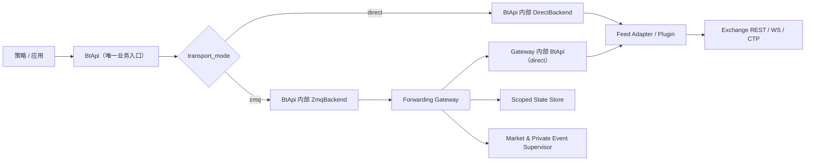

# BtApi Single Business API and ZMQ Gateway Acceptance Iteration Implementation Plan

> **For Codex:** REQUIRED SUB-SKILL: Use superpowers:executing-plans to implement this plan task-by-task.

**Goal:** Turn `bt_api_py` into a verifiably consistent multi-exchange trading API whose sole business entry point is `BtApi`, with direct calls and a safe ZeroMQ forwarding mode for market data, orders, and account queries.

**Architecture:** Keep `BtApi` as the only public business facade. Its typed request/result contract and private direct/ZMQ operation backends live behind that class; applications never select or import a second trading client. Exchange-specific code stays behind certified adapters and advertised capabilities. The forwarding runtime becomes a real gateway: it owns exchange credentials and connections, pumps public/private exchange events, routes commands with durable idempotency, and exposes only authenticated, authorized endpoints.

**Tech Stack:** Python 3.11 (repository baseline), `bt_api_base` plugin registry, dataclasses/`Decimal`, pytest + pytest-asyncio, pyzmq/CurveZMQ, SQLite for the single-node MVP state store, ruff, mypy, GitHub Actions, testnet credentials stored outside the repository.

---

## 快速导航

- [§1 文档目的、范围与验收结论](#1-文档目的范围与验收结论) — 本次验收结论、审查范围、复验证据、工作区状态、开放决策
- [§2 审查发现与风险登记册](#2-审查发现登记册) — 15 项发现（P0/P1/P2）与 6 项风险
- [§3 架构决策](#3-推荐的目标范围与架构决策) — 方案比较、组件边界
- [§4 需求规格说明](#4-需求规格说明需规) — 功能需求、领域契约、等价矩阵、安全需求
- [§5 迭代顺序与里程碑](#5-总体迭代顺序与里程碑) — I0–I6 概览、依赖、退出条件
- [§6 执行与交付规则](#6-全局执行与交付规则) — 8 条全局规则
- [§7 详细开发计划](#7-详细开发计划) — 每迭代的 Task 分解（TDD 步骤）
- [§8 总体验收清单](#8-总体验收清单) — 13 项硬性验收条目（含任务追溯）
- [§9 人员分工与交接](#9-建议的人员分工与交接包)
- [§10 完成定义](#10-本计划完成后的定义)
- [附录 A：发现到任务映射矩阵](#附录-a发现到任务映射矩阵)
- [附录 B：BtApi 收敛与兼容策略](#附录-bbtapi-v1-统一入口收敛与兼容策略)
- [附录 C：迭代回滚策略](#附录-c迭代回滚策略)
- [附录 D：性能基准目标](#附录-d性能基准目标)

---

## 1. 文档目的、范围与验收结论

### 1.1 本次验收结论

**结论：不通过实盘网关验收。**

代码已经具备了 `BtApi` 外观接口、`forwarding` 模块、ZeroMQ PUB/SUB 与 ROUTER/DEALER 原语，也完成了上一轮的一批修复；但“任意交易所可统一直连，并可等价地经 ZMQ 查询/下单/查账户”的端到端承诺尚未成立。尤其是下单参数映射、真实交易所桥接、ZMQ 命令关联、安全边界与插件交付链路存在阻断项。

在本计划的 P0 任务和“参考交易所”验收完成前，必须把 forwarding 标注为**本地实验/模拟用途**，不得用它承载生产账户或对公网/不受信网络开放端口。

### 1.1.1 2026-08-18：唯一业务入口决议

`BtApi` 是唯一面向策略、应用和业务代码的交易接口。不得新增第二个 public trading client，也不得让业务代码直接调用 `ForwardingClient`、`ZmqForwardingClient`、`GatewayClient`、Feed 或内部 adapter。

direct 与 ZMQ 只是同一个 `BtApi` 实例的 `transport_mode` 配置；请求/结果 dataclass、能力报告和内部 backend 可以新增，但它们不是可替代 `BtApi` 的业务接口。旧版本中有关“新增 client、把 `BtApi` 降为兼容 facade”的设计在本次修订后全部撤销。

### 1.2 本次审查范围

- 根包 `bt_api_py/`：`BtApi` 统一入口、插件加载、Broker 抽象、forwarding、gateway、测试和 CI。
- `bt_api/` 下 60 个 git 子模块的可发现性、接口契约和发布边界；**优先通过 venue mapper 层适配差异，不修改子模块既有业务逻辑**；仅在 mapper 无法覆盖的契约缺口（如下单参数签名不兼容）时，才在子模块中做最小、向后兼容的修正，并按 §6 规则 4 完成子模块独立 commit/push → 父仓 pin 的完整链路。
- 直连、行情订阅、账户/持仓/订单查询、下单/撤单、ZMQ 转发的语义一致性。
- 仅使用本地模拟与静态审查；**没有使用任何真实 API Key、没有发出真实订单，也没有以网络结果声称某交易所已通过认证。**

不在本轮范围内：把项目重写为百万并发微服务、引入 Kafka/Kubernetes、一次性重写全部 60 个交易所。现有 `docs/architecture/distributed-system-design.md` 的大规模微服务蓝图不应阻塞统一接口和网关基线建设。

### 1.3 已执行的复验与证据

| 检查 | 实际结果 | 解释 |
| --- | --- | --- |
| 核心直连/forwarding 测试 | `125 passed in 3.96s` | 说明 mock 驱动的基础行为大部分可运行，不能证明真实交易所可用。 |
| 当前离线完整基线 | `522 passed, 3 failed, 3 deselected` | 失败为 Alpaca 插件两项和插件数量断言一项；当前基线不是绿色。 |
| 已安装插件 | `30` 个 `bt_api.plugins` entry point | 仓库有 60 个子模块，运行环境无法自动发现其中大约一半。 |
| 静态检查 | `ruff check bt_api_py tests` 报 `625` 项；`mypy bt_api_py tests` 报 `94` 项 | 现有 CI quality job 在当前 HEAD 上不应视作可信绿灯。 |
| ZMQ 超时关联 | 本地延迟服务器复现：第一个命令超时后，第二个命令收到第一个命令的 ACK | 是错误确认/错误重试的实盘级风险。 |
| 转发桥接订阅 | `BtApiForwardingAdapter.subscribe(..., ["ticker"])` 实际抛 `SubscribeError` | bridge 传 `list[str]`，而 `BtApi.subscribe` 要求 `list[dict]`。 |
| 转发账户查询失败路径 | 无 command handler 时返回 `{'cash': 0.0, 'value': 0.0}`、空持仓和空订单 | 失败被伪装成有效零资产快照。 |

复验命令（本机 Anaconda 环境）如下，后续每轮验收应保留同类原始输出作为构建产物：

```bash
/Users/yunjinqi/opt/anaconda3/bin/conda run -n base python -m pytest \
  tests/test_bt_api_unified.py tests/test_bt_api_quality.py \
  tests/test_broker_contract.py tests/test_broker_loader.py \
  tests/test_forwarding_schema.py tests/test_forwarding_bus_router_client.py \
  tests/test_forwarding_zmq_transport.py -q

/Users/yunjinqi/opt/anaconda3/bin/conda run -n base python -m pytest tests \
  -m 'not network and not integration and not performance and not e2e and not ctp' -q

/Users/yunjinqi/opt/anaconda3/bin/conda run -n base ruff check bt_api_py tests
/Users/yunjinqi/opt/anaconda3/bin/conda run -n base mypy bt_api_py tests --ignore-missing-imports
```

> 说明：以上命令前缀 `/Users/yunjinqi/opt/anaconda3/bin/conda run -n base` 是 2026-08-17 本机基线环境的快照，仅用于复现本节证据。执行者与 CI 应使用各自环境中语义等价的命令（`pytest`/`ruff`/`mypy`），不应把该绝对路径视为计划的一部分；后续迭代如统一了 `uv`/venv 入口，应同步更新本节命令。

### 1.4 当前代码与工作区状态

- 根仓库 `master` 比 `origin/master` 领先 21 个提交。必须先将要保留的提交推送并由远端 CI 验证，不能只以本机报告作为发布依据。
- 根仓库的 `bt_api_ctp` gitlink 指向 `a8a3792`，工作目录实际 checkout 为 `b1e21b3`（子模块内部干净、父仓显示 modified）。这不是本计划应擅自覆盖的改动；迭代 0 必须由维护者确认、审查并决定是否 pin。
- 顶层 `AGENTS.md` 引用的 `.joyincode/rules/backend.md`、`.joyincode/rules/frontend.md` 在当前工作区为空目录中不存在。本计划遵循仓库可读取的 `docs/AGENTS.md`；缺失规则文件应由仓库维护者恢复或移除引用。

### 1.5 开放决策登记册

以下决策必须在指定时限内由负责人给出明确结论并回写本表；未关闭前，被阻塞的任务不得启动。结论产生后同步反映到 Task 0.1 的 baseline manifest。

| ID | 决策 | 选项/建议 | 负责人 | 时限 | 阻塞 |
| --- | --- | --- | --- | --- | --- |
| D-01 | `bt_api_ctp` gitlink 偏差处置 | pin 工作目录 `b1e21b3`，或恢复父仓记录的 `a8a3792`；须先审查 `a8a3792..b1e21b3` 的差异 | 仓库维护者 | I0 退出前 | Task 0.1 报告完整性、Task 2.2 的 CTP mapper |
| D-02 | `core-reference` bundle 组成 | 建议 Binance Spot + OKX Spot + CTP Future；维护者可将 CTP 替换为 Bybit/IB | 维护者 + exchange owner | I2 启动前 | Task 2.1、Task 2.2、I2 退出条件 |
| D-03 | 根包 Python 支持版本统一 | 建议 3.11–3.13；需同步 `requires-python`、README、`reusable-compat-matrix.yml`（当前摘要声称 3.9–3.14） | core contract owner | Task 0.3 内 | Task 0.3、CI compatibility job |
| D-04 | 领先 `origin/master` 的 21 个提交的推送与远端 CI 验证 | 直接 push，或拆分 review 后 push | QA/release owner | I0 退出前 | §8 第 1 条验收项 |
| D-05 | 顶层 `AGENTS.md` 引用的缺失规则文件 | 恢复 `.joyincode/rules/backend.md`、`frontend.md`，或移除引用 | 仓库维护者 | I0 内 | 无（低风险；消除执行者规则来源歧义） |

## 2. 审查发现登记册

严重度定义：P0 会造成实盘资金、账户隐私或发布真实性风险，或使主目标无法完成；P1 阻止交易所认证/稳定交付；P2 是可维护性、性能或文档债务。

| ID | 级别 | 发现与证据 | 影响 | 计划落点 |
| --- | --- | --- | --- | --- |
| U-01 | P0 | `BtApi.make_order()` 只接受 `limit`/`market`，却把 `price`、`order_type` 作为固定位置参数转发。OKX `trade_mixin.py` 要求 `buy-limit` 形式并执行 `side, ord_type = order_type.split("-")`；Bybit spot 的参数顺序是 `(symbol, qty, side, order_type, price)`。 | 新统一入口既不能表达明确买卖方向，也会拒绝或错位传递已认证子包的下单参数。 | I1、I2 |
| U-02 | P0 | `BtApiForwardingAdapter.subscribe()` 传递 `list[str]`，`BtApi.subscribe()` 要求 `list[dict]`；本地复现为 `SubscribeError`。 | 现有 BtApi 行情队列不能经该 bridge 正常订阅/转发。 | I3 |
| U-03 | P0 | `ZmqForwardingRuntime` 的测试均使用 `MockBrokerAdapter`；`GatewayBridgeAdapter.place_order/cancel_order` 明确返回 `NOT_SUPPORTED`；`bt_api.adapters` 没有和交换所 `bt_api.plugins` 注册链路对接。 | ZMQ 运行时没有经证明的真实交易所订单、账户、持仓桥接。 | I2、I3 |
| U-04 | P0 | `ForwardingRuntime.start()` 只连接 adapter，代码中没有消费 `BrokerAdapter.stream_events()` 的运行任务；私有事件只在本次 place/cancel 路径中合成。 | 交易所外部成交、撤单、账户和持仓变动不能可靠推送或对账。 | I3、I5 |
| U-05 | P0 | `ZmqCommandClient.send()` 超时仅 drain 当时已到达的数据，未重建 socket、未校验 ACK 的 `command_id`/`idempotency_key`。已复现“second request received ack for: first”。 | 超时后可能把 A 订单确认给 B 命令，导致错误状态、错误重试或重复下单。 | I4 |
| U-06 | P0 | `ForwardingClient.get_balance/get_positions/fetch_open_orders` 在 handler 缺失或超时时静默回落到默认零/空缓存。 | 查询失败会伪装成“账户为空”，风险系统和人工操作都会被误导。 | I1、I4 |
| U-07 | P0 | ZMQ server/client 没有 CurveZMQ、身份、ACL、命令签名或 account/strategy 绑定；private topic 可由任意订阅前缀请求；且 `ZmqForwardingRuntime` 在 `private_endpoint` 缺省时回落为 `market_endpoint`（`bt_api_py/forwarding/service.py`），私有事件与公共行情默认共用同一个未认证 PUB 端口。**即使在 loopback-only 本地部署中，缺少进程内隔离也意味着任何同机进程可读私有事件或冒充账户提交命令。** | 若 TCP 端口不是严格受信的 loopback/IPC，任意连接方可能读私有事件或冒充账户提交命令；即使 loopback 部署，同机多用户/多进程环境也存在横向越权风险。 | I0、I4 |
| U-08 | P1 | 本机 30 个插件，`.gitmodules` 60 个子模块；`tests/test_plugin_discovery.py` 仍硬编码 `>=61`，且离线基线失败。 | “支持 N 个交易所”不可部署、不可复现、不可验收。 | I0、I2、I6 |
| U-09 | P1 | ZMQ command 只覆盖 place/cancel/account/positions/orders；没有与直连等价的 ticker/depth/kline 快照、query order、cancel all、fills/deals/trades、命令状态查询。 | “直接查询或经 ZMQ 转发”不是同一接口，也无法替换调用模式。 | I1、I4 |
| U-10 | P1 | `BtApi.subscribe()` 对“交易所已添加但没有 stream handler”仅 log，且在成功确认前增加 `subscribe_bar_num`。 | 调用方无法区分成功、能力不支持和部分失败；本地状态会漂移。 | I1、I3 |
| U-11 | P1 | `SQLiteStateStore.command_acks` 仅以全局 `idempotency_key` 为主键，没有 account/exchange/strategy scope、请求指纹、TTL 或容量回收。 | 跨账户键碰撞可能返回错误 ACK；私有历史和 ACK 可无限增长。 | I4、I5 |
| U-12 | P1 | `MarketDataHub.subscribe()` 订阅的是自身内存 bus，不管理上游交易所订阅；ZMQ PUB/SUB 没有 HWM、序列缺口检测、快照补偿或慢消费者恢复。 | “引用计数/一条行情连接供多策略”仅是局部簿记，不是可运行的上游订阅管理。 | I3、I5 |
| U-13 | P1 | 当前完整离线基线红；ruff 625 项、mypy 94 项。大量 `Any`、`**kwargs` 与 mock-only 测试无法构成统一接口保证。 | CI 不能阻止回归，外部开发者会在不稳定基线上叠加改动。 | I0、I6 |
| U-14 | P2 | `BtApi` 异步方法是动态代理，`get_request_api()` 对未找到交易所返回 `None`，批量方法吞掉部分异常并省略失败项；文档仍混用“73+”、“61”、“60”。 | 调用语义、可观测性和支持声明不一致。 | I1、I6 |
| U-15 | P2 | URL/testnet 配置、跨子包签名/时间戳/限速重复、5 个子模块超 800 行的遗留项仍存在。 | 长期维护成本高，适配器修复容易再次漂移。 | I2、I6 |

### 2.1 风险登记册

| ID | 风险 | 影响 | 触发信号 | 缓解与降级路径 |
| --- | --- | --- | --- | --- |
| R-01 | testnet 凭证或环境不可用 | 阻塞 Task 2.2 Step 4 与 Task 5.3 的写入认证 | 凭证申请超过 5 个工作日未到位 | 先完成只读 + mock 认证，将该 venue 标为 `read_only_certified`（Tier B），不得冒充 `certified` |
| R-02 | ruff/mypy 存量修复引入行为回归 | 破坏现有 522 通过的离线基线 | 分批修复后离线 pytest 出现新失败 | Task 0.3 的模块分批 + 行为测试先行；禁止一次性 `ruff --fix --unsafe-fixes` 全仓覆盖 |
| R-03 | 参考 venue（尤其 OKX/CTP）契约缺口大于预期 | I2 超期并波及 I5 认证 | 单 venue mapper 估算超过 5 人日 | mapper 层隔离差异，不改核心契约；必要时按 D-02 更换参考 venue |
| R-04 | CurveZMQ/ACL 实现复杂度导致 I4 超期 | 远程模式延期 | I4 超过估算上限（10 人日） | 默认 loopback-only 已是安全态；可将远程认证子项（Task 4.4 的远程部分）延后至 I5 单独验收，其余 I4 内容照常交付 |
| R-05 | 子模块 dirty/pin 偏差范围大于当前认知（父仓当前仅见 CTP 一项） | U-08 交付链路不可复现 | Task 0.1 manifest 显示多个 dirty 或 pin 偏差子模块 | manifest 量化后由维护者逐个决议；I0 决议前维持 §6 规则 4，禁止任何强制递归更新 |
| R-06 | 关键角色单点（每 venue 单 owner） | 认证卡与交接断档 | 任一 owner 连续 2 周不可用 | §9 交接包 + 认证卡模板强制填写；每张认证卡至少两名复核人 |

## 3. 推荐的目标范围与架构决策

### 3.1 方案比较

| 方案 | 做法 | 结论 |
| --- | --- | --- |
| A. 继续在现有 `BtApi` 上逐个补 if/kwargs | 直接修补每个交易所的参数差异 | 不推荐。会继续把“统一层”变成交易所特例集合，无法证明 ZMQ 与直连等价。 |
| B. 新增第二个 public trading client | 让新 client 承担 v1 契约，保留 `BtApi` 作为 legacy facade | **明确拒绝。** 会造成双入口、双示例、双认证路径和迁移成本，违背本计划的唯一业务入口决议。 |
| C. `BtApi` facade + 私有契约/backends + 单节点网关 | 将稳定的方法语义、typed request/result 和 capability 收敛到 `BtApi`；direct/ZMQ 仅是其内部 transport；先认证少量参考交易所，再按能力卡扩展 | **推荐。** 保留已有调用心智和独立子包，避免把交易所细节扩散到业务代码，并建立可复制的认证流程。 |
| D. 立即做完整微服务/Kafka/Kubernetes 重构 | 同时拆用户、订单、行情、风控服务 | 不推荐。与当前最紧迫的订单正确性和适配器交付问题不成比例。 |

### 3.2 推荐的组件边界



关键边界如下：

- `BtApi` 是唯一稳定业务接口；其同步方法和显式 `async_*` 方法是所有新功能、示例和认证的唯一调用面。`get_request_api()`、直接 Feed 调用和 forwarding client 仅保留为兼容/框架内部路径，不能再作为业务接口文档或认证依据。
- `BtApi(transport_mode="direct")` 为默认模式并直接持有 Feed；`BtApi(transport_mode="zmq")` 通过其私有 `ZmqBackend` 调用 gateway。两种模式必须暴露同名的 `BtApi` 方法、同一 request/result 类型及同一错误语义。
- Gateway 进程内部只创建一个 direct-mode `BtApi` 来持有交易所凭证和 Feed；远端/策略进程只创建 ZMQ-mode `BtApi`，不得接收或复制交易所 API Key。两者之间只传递经 schema/ACL 校验的命令、快照和事件。
- `bt_api_py/_contracts/`、`bt_api_py/_direct_backend.py`、`bt_api_py/forwarding/btapi_backend.py` 等模块仅承担实现分层；禁止在 README、认证卡或业务示例中作为可替代客户端出现。
- 交易所 package 继续是独立包，通过 PluginInfo/能力清单被发现；根包不复制交易所 HTTP 签名或 REST 实现。
- `Forwarding Gateway` 独占真实交易所 API Key、长连接和私有事件；策略端只持有最小化的网关凭证。
- ZMQ 用于数据与命令传输，不被赋予“默认可信”的安全前提。远程 TCP 必须认证；本机开发默认 loopback 或 IPC。

## 4. 需求规格说明（需规）

### 4.1 范围内的功能需求

| 编号 | 需求 | 验收规则 |
| --- | --- | --- |
| FR-01 | `BtApi` 是唯一业务类；它提供同步方法及显式 `async_*` 对应方法，direct/zmq 两种模式共享同一组方法、request/result 类型和错误。 | 对同一 fake/certified adapter，两个 `BtApi` 模式返回等价领域对象或相同的 typed error；业务示例不得实例化其他交易 client。 |
| FR-02 | 下单必须使用显式 `side`、`order_type`、`quantity`、可选 `price`、`time_in_force`、`reduce_only`、`client_order_id`。金额和数量采用 `Decimal`。 | 没有 `side`、不合法精度、市场单带非法价格、能力不支持时，在调用交易所前失败。 |
| FR-03 | 支持行情快照（ticker/depth/kline）、行情流订阅/取消订阅、账户、余额、持仓、订单列表、成交、下单、撤单、撤全、订单查询和命令状态查询。 | 每个操作在 capability matrix 中被声明为 supported/unsupported；不允许”返回空值表示不支持”。 |
| FR-04 | 支持行情与私有事件订阅、取消订阅、快照、重放和序列缺口通知。 | 两个本地策略订阅同一个 market key 时仅有一个上游订阅；断线后能检测 gap 并获取快照。 |
| FR-05 | `consistency=LIVE` 的查询失败必须抛明确异常；`consistency=CACHE_OK` 才可返回缓存，并带 `freshness`、`observed_at`、`stale_reason`。 | 无 handler/超时时不得返回伪造的零余额或空持仓。 |
| FR-06 | ZMQ 命令必须具有 `command_id`、scope-aware idempotency key（`OrderRequest.idempotency_key` 和 `CancelOrderRequest.idempotency_key`）、payload fingerprint 和状态查询。 | 延迟 ACK、重复请求、进程重启、并发 client 不会错误关联 ACK 或重复执行订单。 |
| FR-07 | Gateway 必须把真实 adapter 的 public/private stream 持续转为标准事件，并在重连后进行订单/持仓对账。 | 不依赖手工调用 `forward_once()` 才能产生行情；模拟外部 fill 后客户端能收到私有事件。 |
| FR-08 | 所有交易所能力必须可查询。支持状态至少分为 `installed`、`loadable`、`certified`、`experimental`、`retired`。 | 不使用 `>=61` 之类的魔法数量；生成的清单能解释每个子模块的状态与缺失原因。 |

### 4.2 `BtApi` v1 操作契约（唯一业务调用面）

新的 typed request/result 位于私有实现包 `bt_api_py/_contracts/`，必要的 dataclass/enum 可从 `bt_api_py` 重导出供调用方构造参数；它们是数据类型，不是第二个业务 client。所有操作必须经 `BtApi` 调用，禁止新增 client factory、direct client 或 ZMQ client 作为业务调用面。字段可在设计评审中增加，但不能删除或以无类型 `**kwargs` 代替。

```python
from dataclasses import dataclass
from datetime import datetime
from decimal import Decimal
from enum import StrEnum


class Side(StrEnum):
    BUY = "buy"
    SELL = "sell"


class OrderType(StrEnum):
    MARKET = "market"
    LIMIT = "limit"


class Consistency(StrEnum):
    LIVE = "live"
    CACHE_OK = "cache_ok"


class TransportMode(StrEnum):
    DIRECT = "direct"
    ZMQ = "zmq"


@dataclass(frozen=True)
class ForwardingConfig:
    command_endpoint: str
    market_endpoint: str
    private_endpoint: str
    account_id: str
    strategy_id: str


@dataclass(frozen=True)
class OrderRequest:
    symbol: str
    side: Side
    order_type: OrderType
    quantity: Decimal
    price: Decimal | None
    account_id: str
    client_order_id: str
    time_in_force: str = "GTC"
    reduce_only: bool = False
    idempotency_key: str = ""  # 由调用方提供或由 BtApi 自动生成；ZMQ 模式下用于去重


@dataclass(frozen=True)
class Freshness:
    source: str              # live | cache | replay
    observed_at: datetime
    stale: bool = False
    stale_reason: str | None = None


class BtApi:
    """唯一 public business facade；transport 在实例内部选择。"""

    def __init__(
        self,
    exchange_kwargs: dict[str, object] | None = None,
    debug: bool = True,
    event_bus: "EventBus | None" = None,
        *,
        transport_mode: "TransportMode" = TransportMode.DIRECT,
        forwarding_config: "ForwardingConfig | None" = None,
    ) -> None: ...

    # ── Market data snapshots ──
    def get_tick(self, exchange_name: str, symbol: str, *, consistency: Consistency = Consistency.LIVE) -> "TickerSnapshot": ...
    def get_depth(self, exchange_name: str, symbol: str, count: int = 10, *, consistency: Consistency = Consistency.LIVE) -> "DepthSnapshot": ...
    def get_kline(self, exchange_name: str, symbol: str, period: str, count: int = 500, *, consistency: Consistency = Consistency.LIVE) -> list["KlineSnapshot"]: ...

    # ── Account & portfolio ──
    def get_account(self, exchange_name: str, *, consistency: Consistency = Consistency.LIVE) -> "AccountSnapshot": ...
    def get_balance(self, exchange_name: str, *, consistency: Consistency = Consistency.LIVE) -> list["BalanceSnapshot"]: ...
    def get_position(self, exchange_name: str, *, consistency: Consistency = Consistency.LIVE) -> list["PositionSnapshot"]: ...

    # ── Orders & fills ──
    def make_order(self, exchange_name: str, request: OrderRequest) -> "OrderSnapshot": ...
    def cancel_order(self, exchange_name: str, request: "CancelOrderRequest") -> "OrderSnapshot": ...
    def cancel_all(self, exchange_name: str, request: "CancelAllRequest") -> list["OrderSnapshot"]: ...
    def query_order(self, exchange_name: str, request: "QueryOrderRequest") -> "OrderSnapshot": ...
    def get_open_orders(self, exchange_name: str, *, consistency: Consistency = Consistency.LIVE) -> list["OrderSnapshot"]: ...
    def get_deals(self, exchange_name: str, *, consistency: Consistency = Consistency.LIVE) -> list["FillSnapshot"]: ...

    # ── Streaming ──
    def subscribe(self, request: "SubscribeRequest") -> "SubscriptionHandle": ...
    def unsubscribe(self, handle: "SubscriptionHandle") -> None: ...

    # ── Command status (ZMQ mode; direct mode returns terminal immediately) ──
    def get_command_status(self, command_id: str) -> "CommandStatus": ...

    # ── Introspection ──
    def get_capabilities(self, exchange_name: str) -> "CapabilityReport": ...
    def health(self) -> "HealthReport": ...

    # 同名的 async_get_tick / async_get_depth / async_make_order / ...
    # 是此类的显式方法，不由 __getattr__ 动态代理。
```

`cancel_order` 的入参必须能唯一定位订单，最小定义如下（`order_id` 与 `client_order_id` 至少提供一个，两者皆空必须在调用交易所前失败）：

```python
@dataclass(frozen=True)
class CancelOrderRequest:
    symbol: str
    account_id: str
    order_id: str | None = None
    client_order_id: str | None = None
    idempotency_key: str = ""
```

`cancel_all` 按 account 与 `BtApi` 传入的 `exchange_name` 维度批量撤销，`symbol` 可选（为空表示该 market 下全部 symbol）：

```python
@dataclass(frozen=True)
class CancelAllRequest:
    account_id: str
    symbol: str | None = None
    idempotency_key: str = ""
```

`query_order` 与 `cancel_order` 使用相同的定位逻辑：

```python
@dataclass(frozen=True)
class QueryOrderRequest:
    symbol: str
    account_id: str
    order_id: str | None = None
    client_order_id: str | None = None
```

行情订阅请求：

```python
@dataclass(frozen=True)
class SubscribeRequest:
    exchange_name: str
    symbols: list[str]
    topics: list[str]  # "ticker", "depth", "kline_1m", "kline_5m", ...
    account_id: str | None = None  # 私有流需要 account
```

`TickerSnapshot`、`AccountSnapshot`、`OrderSnapshot` 等都必须含统一 ID、`Freshness` 和 `raw`（受脱敏规则控制）字段。对于交易所特有能力，使用显式 `extensions` 或专属方法，不能污染 v1 的必填字段。旧 `BtApi.subscribe(dataname, topics)` 同样仅作为 compatibility overload，必须先转换为 `SubscribeRequest`；新示例使用 typed request。

`ForwardingConfig.account_id` / `strategy_id` 只是 `BtApi` 请求的期望 scope，不是身份凭据；gateway 必须根据经认证的 principal 校验或覆盖它们，不能信任 client 传入值。

**同步与异步：** 不创建 Sync/Async client 类型。`BtApi` 的同步方法是默认业务入口；对应的显式 `async_*` 方法在同一个对象上调用同一 private backend。Direct 模式优先使用原生同步/异步 Feed 能力；ZMQ 模式在 backend 内部使用同步或异步 transport，避免在调用方 event loop 中嵌套 `asyncio.run()`。

**旧位置参数兼容：** 保留原有 `BtApi.make_order(exchange_name, symbol, volume, price, order_type, ...)` 重载一个兼容版本，但先在 `BtApi` 内部转换为 `OrderRequest`。能明确解析的 `buy-limit`/`sell-market` 可转换；只有 `limit`/`market` 而没有可推导 `side` 的调用，必须在调用 Feed 前抛 `LegacyOrderApiError`，并给出改为 `BtApi.make_order(exchange_name, OrderRequest(...))` 的迁移说明。`BtApi` 本身不废弃。

### 4.3 调用模式等价矩阵

| 操作 | `BtApi(transport_mode="direct")` | `BtApi(transport_mode="zmq")` | 备注 |
| --- | --- | --- | --- |
| ticker/depth/kline 快照 | 必须 | 必须（命令查询） | PUB/SUB 只负责流，不能替代确定性查询。 |
| 行情流订阅/取消订阅 | 必须 | 必须 | ZMQ 必须有 HWM、快照与 gap 策略。 |
| account/balances/positions/open orders | 必须 | 必须 | 默认 live；缓存回退必须显式标注。 |
| place/cancel/cancel-all/query order | 必须 | 必须 | 订单写入需显式幂等和确认状态。 |
| fills/trades | 必须 | 必须 | 区分 public trades 与 private fills。 |
| capability/health | 必须 | 必须 | 调用前即可判断是否支持。 |
| 命令状态/对账 | 本地返回终端状态 | 必须 | Direct 模式下命令同步返回终端状态；ZMQ 模式下需支持 `get_command_status` 查询异步结果。 |

### 4.4 安全、可靠性和可运维需求

- 默认 `READ_ONLY`。生产写操作要同时满足：显式 `enable_trading=True`、已认证 adapter、账号/交易对 ACL、风控规则和可用审计出口。
- 私有 endpoint 不得默认与公开行情 endpoint 共用。远程 TCP 使用 CurveZMQ 双向认证，按 client public key 映射 principal 与权限。本机 loopback TCP 在单用户环境下可接受为最小安全边界；IPC（`ipc://`）提供文件系统权限隔离，推荐用于同机多用户部署；多用户 loopback 环境仍需认证。
- 服务端不信任命令中的 `account_id`、`strategy_id`；它们必须由认证后的 principal 校验或覆盖。
- 每个写命令状态为 `accepted`、`rejected`、`result_unknown`、`reconciled`、`terminal` 之一；超时永远不是“失败且可安全重发”的同义词。
- 市场消息可采用“保最新值”策略，但必须显式统计丢失与 sequence gap。订单、成交、账户、持仓事件不得因慢消费者静默丢失。
- 所有时间用 UTC，传输时间戳统一毫秒整数；精度、数量、价格不使用二进制 float 做业务比较。
- Gateway 需要 readiness/liveness、每交易所连接状态、请求耗时、重试、拒绝原因、事件积压/丢失、对账差异等 metrics。

### 4.5 非目标与兼容策略

- `BtApi` 不废弃，且是 v1 的唯一业务接口。仅其原有的裸 Feed escape hatch（`get_request_api()`）以及无法解析 side 的旧位置参数下单/订阅重载属于兼容路径；I1 会把动态 async proxy 替换为显式 async 方法。它们不能作为新示例或认证依据。
- 现有 `bt_api_py/backtrader/btapibroker.py`（Backtrader 集成）维持现有接口不变，但其 forwarding 路径必须通过一个 `BtApi(transport_mode="zmq")` 实例实现。`ForwardingClient`/`GatewayClient` 只作为 Backtrader 兼容适配器保留，且不新增业务能力。
- 不为所有 60 个子模块承诺完整交易能力。只有通过能力卡、contract tests 和 testnet/manual certification 的 venue/market 才能标记为 `certified`。
- 不在本计划中自动使用生产凭证、自动创建真实订单或自动 push/发布任何子模块。

### 4.6 需求到任务的追踪

| 需求 | 主要落点任务 |
| --- | --- |
| FR-01 | Task 1.1、Task 1.2、Task 4.2（direct/ZMQ parity） |
| FR-02 | Task 1.1、Task 2.2 |
| FR-03 | Task 1.1、Task 1.3、Task 4.2、Task 2.2 |
| FR-04 | Task 3.1、Task 5.1 |
| FR-05 | Task 1.2、Task 4.2 |
| FR-06 | Task 4.1、Task 4.3 |
| FR-07 | Task 3.2、Task 5.1 |
| FR-08 | Task 0.1、Task 2.1、Task 6.2 |

## 5. 总体迭代顺序与里程碑

| 迭代 | 主题 | 主要问题 | 依赖 | 预计工作量 | 退出条件 |
| --- | --- | --- | --- | --- | --- |
| I0 | 基线冻结与安全止血 | U-07、U-08、U-13、工作区状态 | 无 | 3–5 人日 | 基线可复现；核心路径（`BtApi`、`_contracts`、forwarding、gateway、broker）ruff/mypy 全绿，其余模块红因记录在 manifest；远程/子模块状态有决议；生产 gateway 默认禁用。 |
| I1 | v1 契约与语义收敛 | U-01、U-06、U-09、U-10、U-14 | I0 | 4–6 人日 | Direct/ZMQ 对外方法、错误、freshness 与能力语义有测试。 |
| I2 | 插件交付与直连参考适配器 | U-01、U-03、U-08、U-15 | I1 | 5–8 人日 | 三个参考 venue（组成以 D-02 决议为准）的 direct contract test 与 testnet read-only 认证通过。 |
| I3 | 真实行情/私有事件桥接 | U-02、U-03、U-04、U-12 | I1、I2 | 5–8 人日 | 无手工轮询地完成一条连接、多订阅者、私有事件与重连对账。 |
| I4 | ZMQ 正确性、状态与访问控制 | U-05、U-06、U-07、U-09、U-11 | I1、I3 | 6–10 人日 | 延迟/重复/重启/越权/缓存场景全绿；远程模式安全可审计。 |
| I5 | 可靠性与端到端认证 | U-04、U-11、U-12 | I2–I4 | 5–8 人日 | 故障注入、测试网、可观测性、人工演练通过。 |
| I6 | CI、发布与交易所分批认证 | U-08、U-13、U-14、U-15 | I0–I5 | 持续 | 每个已认证包有可复用能力卡，主干 CI 与发布清单可信。 |

总量与关键路径：I0–I5 合计约 28–45 人日（I6 为持续性工作，不占迭代窗口；I6 单次 bundle 扩展约 2–4 人日，全量 60 子模块认证为长期渐进过程）。关键路径为 I0 → I1 → I2 → I3 → I4 → I5；其中 I3 的 **行情/私有事件桥接** 依赖 I2 的参考 venue 就绪（需要真实 adapter 才能连接事件泵），但 I3 的 **BtApiForwardingAdapter 修正与 source supervisor**（Task 3.1）可在 I1 完成后用 mock adapter 先行启动，待 I2 交付后再完成 Task 3.2 的对接。任何关键路径迭代超过估算上限时，先回到 §2.1 风险登记册评估降级路径，不得以裁剪质量门禁换取工期。

## 6. 全局执行与交付规则

1. **先测后改。** 每项代码任务必须按 RED → 运行确认失败 → 最小实现 → GREEN → lint/type → 提交执行；禁止以“原有测试绿”代替新增回归测试。
2. **禁止隐式实盘。** 自动化测试只可使用 mock、录制回放或 testnet；生产写命令需要人工确认的环境开关，CI 永远不注入生产密钥。
3. **一次一个可审查边界。** Contract、transport、security、exchange adapter 不能混在同一大型提交中。
4. **子模块纪律。** 修改子模块时，先在子模块完成测试、commit、push，再更新父仓 gitlink；在 I0 决议前不得对 `bt_api/` 执行强制递归更新。
5. **质量门禁不降级。** 不新增 `# type: ignore`、ruff ignore、`|| true` 或“失败改 skip”来让 CI 变绿。每个例外必须有 issue、到期日和单独的允许列表。
6. **验收产物。** 每轮保留测试 JUnit/coverage、插件清单 JSON、配置样例、运行日志脱敏样例、commit/pin 清单以及 code review 结论。
7. **迭代中止与回滚。** 每个迭代的提交必须可独立 revert；任一迭代的退出条件在连续两次评审（每次评审间隔不超过 1 周）中均未达成时，停止启动后续迭代，先按规则 8 修订本计划，不得以放宽验收标准代替延期决策。回滚流程见附录 C。
8. **计划变更控制。** 本计划是活文档：范围、顺序或验收标准的任何变化都必须更新本文档并在 git 历史中可追溯（commit 前缀 `docs(plan):`），同步反映到 §1.5 决策登记册与 §2.1 风险登记册；执行者不得以口头约定偏离计划。

## 7. 详细开发计划

### Iteration 0：基线冻结、生产防护与质量恢复

#### Task 0.1：冻结仓库、子模块与支持清单的真实基线

**Files:**

- Create: `docs/acceptance/2026-08-17-baseline-inventory.json`
- Create: `scripts/verify_repository_baseline.py`
- Create: `docs/operations/repository-release-checklist.md`
- Test: `tests/test_repository_baseline.py`

**Step 1: Write the failing test**

让测试创建一个临时 manifest，断言其包含：父仓 commit、每一个 `.gitmodules` path、当前 gitlink、实际 checkout、内部 dirty 状态、entry-point plugin 名称、`installed/loadable/certified` 状态。测试还应覆盖 CTP “父仓 pin 与 checkout 不同”的报告，而不是静默成功。

**Step 2: Run it to verify it fails**

Run:

```bash
/Users/yunjinqi/opt/anaconda3/bin/conda run -n base python -m pytest tests/test_repository_baseline.py -q
```

Expected: FAIL，因为脚本和 schema 尚不存在。

**Step 3: Implement the minimal inventory command**

- 仅使用只读 git 命令和 `importlib.metadata.entry_points()`；不执行 submodule reset/update。
- manifest 使用 `.gitmodules` 作为唯一仓库清单，取消 `>=61` 这类魔法数字。
- 将 CTP 当前情况记录为“待维护者决定 pin b1e21b3 或恢复 a8a3792”，不得自动处理。

**Step 4: Run focused checks**

```bash
/Users/yunjinqi/opt/anaconda3/bin/conda run -n base python scripts/verify_repository_baseline.py --json /tmp/bt-api-baseline.json
/Users/yunjinqi/opt/anaconda3/bin/conda run -n base python -m pytest tests/test_repository_baseline.py -q
```

Expected: PASS；生成的 JSON 可解释 60 个子模块、30 个已安装插件与所有 pin 偏差。

**Step 5: Commit**

```bash
git add scripts/verify_repository_baseline.py tests/test_repository_baseline.py docs/acceptance/ docs/operations/
git commit -m "test: add reproducible repository and plugin baseline"
```

#### Task 0.2：在 P0 修复前默认阻断生产 gateway 写操作

**Files:**

- Create: `bt_api_py/gateway/safety.py`
- Create: `bt_api_py/gateway/config.py`
- Create: `configs/examples/gateway.local.yaml.example`
- Modify: `bt_api_py/forwarding/service.py`
- Modify: `README.md`
- Test: `tests/test_gateway_safety.py`

**Step 1: Write failing tests**

```python
def test_gateway_rejects_remote_or_write_enabled_config_without_explicit_safe_policy():
    with pytest.raises(GatewaySafetyError):
        GatewayConfig(command_endpoint="tcp://0.0.0.0:7002", enable_trading=True)


def test_gateway_defaults_to_read_only_loopback_mode():
    config = GatewayConfig.local_defaults()
    assert config.enable_trading is False
    assert config.is_loopback_or_ipc is True
```

**Step 2: Run the tests to verify they fail.**

**Step 3: Implement the safety policy**

- `GatewayConfig` 默认只允许 loopback 或 IPC，`enable_trading=False`。
- non-loopback TCP、私有事件 endpoint、生产凭证、写操作必须明确配置安全模式；暂时返回安全错误而不是试图猜测。
- README 的“ZeroMQ service”示例标注为 mock/local，直到 I5 完成才增加 production runbook。

**Step 4: Run focused tests and ruff.**

```bash
/Users/yunjinqi/opt/anaconda3/bin/conda run -n base python -m pytest tests/test_gateway_safety.py -q
/Users/yunjinqi/opt/anaconda3/bin/conda run -n base ruff check bt_api_py/gateway tests/test_gateway_safety.py
```

**Step 5: Commit**

```bash
git add bt_api_py/gateway configs/examples README.md tests/test_gateway_safety.py
git commit -m "fix: default forwarding gateway to safe local read-only mode"
```

#### Task 0.3：恢复可执行的质量门禁，而非通过忽略问题获得绿灯

**Files:**

- Modify: `pyproject.toml`
- Modify: `bt_api_py/__init__.py`
- Modify: `bt_api_py/exceptions.py`
- Modify: `bt_api_py/bt_api.py`
- Modify: `bt_api_py/forwarding/service.py`
- Modify: `bt_api_py/data_downloader.py`
- Modify: `bt_api_py/balance_manager.py`
- Modify: `tests/` 中本任务涉及的测试文件
- Test: `tests/test_quality_gates.py`

**Step 1: Freeze the current failures as a machine-readable baseline**

- 将本计划开头的 `625` ruff、`94` mypy、`3` pytest failure 写入 I0 baseline artifact。
- 将 CI 现状一并冻结：`.github/workflows/tests.yml` 的 `COVERAGE_THRESHOLD=40` 与 compatibility 摘要声称的 Python 3.9–3.14。覆盖率门禁在 I0 维持 40% 不降级；目标值（≥80%）由 I6 按模块分阶段提升并在 §8 验收，不允许一步跳变，也不允许静默下调。
- 先修根核心路径（`bt_api.py`、forwarding、gateway、插件 discovery），再按模块分批格式化 risk/monitoring；不要用一次无人审查的大范围 `ruff --fix` 覆盖业务 diff。

**Step 2: Write failing quality tests**

添加针对已知真实缺陷的行为测试，例如 `from bt_api_py.exceptions import *` 不得因 `__all__` 的未定义导出失败；mixin 应通过 Protocol 声明所需宿主属性，而非依赖关闭 `attr-defined`。

**Step 3: Make quality configuration truthful**

- 明确支持的 Python 版本。当前 README/AGENTS 的 3.11+、`requires-python >=3.9` 和 CI 矩阵不能同时作为承诺；建议 v1 统一为 3.11–3.13。
- 禁止再扩大 `mypy.disable_error_code`；用 Protocol、组合而非不透明 mixin 或精确类型补齐修复现有错误。
- 将 ruff/mypy 在核心路径（`bt_api.py`、`_contracts`、forwarding、gateway、broker）上做到全绿作为 I0 退出条件；其余模块（risk/monitoring、data_downloader、balance_manager、containers 等）的存量问题分批记录在 baseline manifest 中，注明负责人和计划修复迭代，不得留在质量 job 中静默失败。

**Step 4: Run the actual gates**

```bash
/Users/yunjinqi/opt/anaconda3/bin/conda run -n base ruff check bt_api_py tests
/Users/yunjinqi/opt/anaconda3/bin/conda run -n base ruff format --check bt_api_py tests
/Users/yunjinqi/opt/anaconda3/bin/conda run -n base mypy bt_api_py tests --ignore-missing-imports
/Users/yunjinqi/opt/anaconda3/bin/conda run -n base python -m pytest tests -m 'not network and not integration and not performance and not e2e and not ctp' -q
```

Expected: 全部 exit 0；插件相关测试应改为由明确的 bundle fixture 驱动，不能因为“当前环境没装插件”而假装通用绿色。

**Step 5: Commit by module**

每个逻辑模块独立提交，例如 `fix: restore forwarding quality gates`、`refactor: type BtApi host mixins`、`test: make plugin environment explicit`。

### Iteration 1：`BtApi` v1 契约、错误语义和能力声明

#### Task 1.1：建立不可含糊的订单与查询领域模型

**Files:**

- Create: `bt_api_py/_contracts/__init__.py`
- Create: `bt_api_py/_contracts/models.py`
- Create: `bt_api_py/_contracts/errors.py`
- Modify: `bt_api_py/bt_api.py`
- Modify: `bt_api_py/__init__.py`
- Test: `tests/bt_api_contract/test_models.py`
- Test: `tests/bt_api_contract/test_order_validation.py`

**Step 1: Write failing tests**

覆盖以下边界：`side` 缺失、`quantity <= 0`、limit 无 `price`、market 传非空 `price`、float 输入、空 account/client id、重复 client id、未知 `exchange_name`。测试必须断言 adapter 没有被调用。

**Step 2: Run the tests to verify RED.**

```bash
/Users/yunjinqi/opt/anaconda3/bin/conda run -n base python -m pytest tests/bt_api_contract/test_models.py tests/bt_api_contract/test_order_validation.py -q
```

**Step 3: Implement v1 dataclasses and typed errors**

- 用 `Decimal`、`StrEnum`、冻结 dataclass；严禁隐式 `float`/字符串兜底。
- 至少定义 `CapabilityNotSupportedError`、`PluginNotInstalledError`、`LiveQueryFailedError`、`StaleDataUnavailableError`、`CommandResultUnknownError`、`ProtocolCorrelationError`、`AuthorizationError`、`LegacyOrderApiError`。
- 每个结果对象带 `Freshness` 和可追踪的 `request_id`/`command_id`。
- `OrderRequest`、`CancelOrderRequest`、`SubscribeRequest`、`TransportMode` 与 `ForwardingConfig` 只作为 `BtApi` 的参数/结果支持类型；顶层包在新增导出中仅增加这些数据类型与 `BtApi`，不得新增 trading client 导出，也不得以本任务破坏现有的兼容 import。

**Step 4: Run GREEN plus type check.**

```bash
/Users/yunjinqi/opt/anaconda3/bin/conda run -n base python -m pytest tests/bt_api_contract/test_models.py tests/bt_api_contract/test_order_validation.py -q
/Users/yunjinqi/opt/anaconda3/bin/conda run -n base mypy bt_api_py/_contracts bt_api_py/bt_api.py tests/bt_api_contract --ignore-missing-imports
```

**Step 5: Commit**

```bash
git add bt_api_py/_contracts bt_api_py/bt_api.py bt_api_py/__init__.py tests/bt_api_contract
git commit -m "feat: define BtApi typed request and result contract"
```

#### Task 1.2：将 direct/ZMQ transport 收敛到 `BtApi`，移除伪造缓存语义

**Files:**

- Create: `bt_api_py/_operation_backend.py`
- Create: `bt_api_py/_direct_backend.py`
- Create: `bt_api_py/forwarding/btapi_backend.py`
- Create: `bt_api_py/_contracts/cache_policy.py`
- Modify: `bt_api_py/bt_api.py`
- Modify: `bt_api_py/__init__.py`
- Modify: `bt_api_py/forwarding/client.py`
- Test: `tests/bt_api_contract/test_direct_zmq_bt_api_contract.py`
- Test: `tests/bt_api_contract/test_freshness_semantics.py`

**Step 1: Write failing tests**

```python
def test_zmq_bt_api_live_query_never_turns_transport_failure_into_zero_balance(zmq_bt_api):
    with pytest.raises(LiveQueryFailedError):
        zmq_bt_api.get_account("SIM___SPOT", consistency=Consistency.LIVE)


def test_bt_api_cache_ok_marks_stale_result(bt_api_with_cached_account):
    account = bt_api_with_cached_account.get_account(
        "SIM___SPOT", consistency=Consistency.CACHE_OK
    )
    assert account.freshness.stale is True
    assert account.freshness.source == "cache"
```

**Step 2: Run RED.**

```bash
/Users/yunjinqi/opt/anaconda3/bin/conda run -n base python -m pytest tests/bt_api_contract/test_direct_zmq_bt_api_contract.py tests/bt_api_contract/test_freshness_semantics.py -q
```

Expected: 当前实现不存在 `transport_mode`/private backend，且 query timeout 仍回落 zero/empty，因此测试失败。

**Step 3: Implement private backends and the `BtApi` boundary**

- `BtApi` 增加 typed `transport_mode` 与 `ForwardingConfig`，默认 direct；两种模式只在 private `OperationBackend` 的选择上不同。禁止公开任何第二业务 client、factory 或 service locator。
- `DirectBackend` 只从 `BtApi` 的已注册 Feed 调用，`ZmqBtApiBackend` 只封装 forwarding command/event transport；两者均返回 `_contracts` 的 request/result/error。
- `BtApi.get_request_api()` 仅保留为兼容 escape hatch；ZMQ 模式必须抛明确的 `CapabilityNotSupportedError`，不能返回 `None`。移除动态 async proxy，改为实际定义的 `async_get_tick`、`async_make_order` 等方法。
- `ForwardingClient` 可继续服务 Backtrader 兼容，但其查询必须委托同一个 `BtApi(transport_mode="zmq")` 实例；不得默认 `{cash: 0.0, value: 0.0}` 或 `[]`。

**Step 4: Run contract tests.**

```bash
/Users/yunjinqi/opt/anaconda3/bin/conda run -n base python -m pytest tests/bt_api_contract/test_direct_zmq_bt_api_contract.py tests/bt_api_contract/test_freshness_semantics.py -q
```

**Step 5: Commit**

```bash
git add bt_api_py/_operation_backend.py bt_api_py/_direct_backend.py bt_api_py/_contracts bt_api_py/bt_api.py bt_api_py/__init__.py bt_api_py/forwarding/btapi_backend.py bt_api_py/forwarding/client.py tests/bt_api_contract
git commit -m "feat: route BtApi through direct and ZMQ backends"
```

#### Task 1.3：把能力、订阅结果和批量结果改为可观察契约

**Files:**

- Create: `bt_api_py/_contracts/capabilities.py`
- Create: `bt_api_py/_contracts/subscriptions.py`
- Modify: `bt_api_py/bt_api.py`
- Modify: `bt_api_py/forwarding/schema.py`
- Test: `tests/bt_api_contract/test_capability_contract.py`
- Test: `tests/test_bt_api_subscription_contract.py`

**Step 1: Write failing tests**

- 已连接但没有 stream handler 时，`subscribe()` 必须返回/抛出明确的 `CapabilityNotSupportedError`，而非 log 后返回。
- 订阅计数仅在上游成功确认后变化；失败、重复订阅、取消订阅均不漂移。
- batch 查询必须返回每个 venue 的成功或失败结果，不能静默省略失败项。

**Step 2: Implement explicit `CapabilityReport` and `SubscriptionHandle`.**

把 Feed 的 `capabilities`、PluginInfo、安装状态合并成一个只读报告；业务调用先检查且保留实际 adapter 错误。不要根据“方法是否存在”或 `hasattr` 推断能力。

**Step 3: Run tests and commit.**

```bash
/Users/yunjinqi/opt/anaconda3/bin/conda run -n base python -m pytest tests/bt_api_contract/test_capability_contract.py tests/test_bt_api_subscription_contract.py -q
git add bt_api_py/_contracts bt_api_py/bt_api.py bt_api_py/forwarding/schema.py tests/
git commit -m "fix: expose explicit subscription and capability outcomes"
```

### Iteration 2：插件交付与参考交易所的直连认证

#### Task 2.1：建立可安装、可诊断、可认证的 exchange bundle 清单

**Files:**

- Create: `configs/exchange-bundles.toml`
- Create: `bt_api_py/_plugin_catalog.py`
- Create: `bt_api_py/doctor.py`
- Create: `scripts/verify_exchange_bundle.py`
- Modify: `pyproject.toml`
- Modify: `tests/test_plugin_discovery.py`
- Test: `tests/bt_api_contract/test_plugin_catalog.py`
- Test: `tests/test_doctor.py`

**Step 1: Write RED tests**

测试 bundle `core-reference`（建议初始为 Binance Spot、OKX Spot、CTP Future；维护者可在 kick-off 前将 CTP 改成 Bybit/IB）在未安装时清楚列出缺失 package，在安装后列出具体 entry point、版本和 capability；不得用总数判定成功。

**Step 2: Implement package and catalog policy**

- 每个 bundle 在 `exchange-bundles.toml` 列出独立包名、支持的 `EXCHANGE___MARKET`、最低版本、testnet/read-only 条件和认证状态。
- 对发布渠道可用的独立包提供标准 extra；本地开发提供明确的 editable-install bootstrap 命令。不要假装“子模块存在于磁盘”就等于 Python 环境可发现。
- `python -m bt_api_py.doctor --bundle core-reference` 输出 machine-readable JSON 与人类摘要。

**Step 3: Run GREEN.**

```bash
/Users/yunjinqi/opt/anaconda3/bin/conda run -n base python -m pytest tests/bt_api_contract/test_plugin_catalog.py tests/test_doctor.py tests/test_plugin_discovery.py -q
/Users/yunjinqi/opt/anaconda3/bin/conda run -n base python -m bt_api_py.doctor --bundle core-reference --format json
```

**Step 4: Commit**

```bash
git add configs/exchange-bundles.toml bt_api_py/_plugin_catalog.py bt_api_py/doctor.py scripts/ tests/
git commit -m "feat: add explicit exchange bundle catalog and doctor"
```

#### Task 2.2：为 `BtApi` 的参考交易所 direct backend 实现订单映射黄金测试

**Files:**

- Create: `bt_api_py/_feed_adapter.py`
- Create: `bt_api_py/_venue_mappers/__init__.py`
- Create: `bt_api_py/_venue_mappers/binance.py`
- Create: `bt_api_py/_venue_mappers/okx.py`
- Create: `bt_api_py/_venue_mappers/ctp.py`
- Modify: `bt_api_py/_direct_backend.py`
- Modify: `bt_api_py/bt_api.py`
- Modify: `bt_api/bt_api_binance/src/bt_api_binance/feeds/rest_trade.py`（仅确有契约缺口时）
- Modify: `bt_api/bt_api_okx/src/bt_api_okx/feeds/live_okx/mixins/trade_mixin.py`（仅确有契约缺口时）
- Modify: `bt_api/bt_api_ctp/src/bt_api_ctp/feeds/live_ctp_feed.py`（须先完成 I0 pin 决议）
- Test: `tests/bt_api_contract/test_feed_adapter_contract.py`
- Test: `tests/bt_api_contract/test_binance_order_mapping.py`
- Test: `tests/bt_api_contract/test_okx_order_mapping.py`
- Test: `tests/bt_api_contract/test_ctp_order_mapping.py`

**Step 1: Write golden mapping tests before adapter code**

至少断言：

- `BtApi.make_order(exchange_name, OrderRequest(side=BUY, order_type=LIMIT, ...))` 映射为 Binance/OKX 各自所需字段，不把 `price` 误传为 side。
- `SELL + MARKET + reduce_only` 的每个 venue mapping 明确，未支持时抛 `CapabilityNotSupportedError`。
- 最小数量、tick size、notional、合约手数、spot/futures position effect 在网络调用前验证。
- 交易所响应被规范为一个 `OrderSnapshot`，包含 exchange order id、client order id、状态和 raw metadata。

**Step 2: Run RED.**

```bash
/Users/yunjinqi/opt/anaconda3/bin/conda run -n base python -m pytest tests/bt_api_contract/test_feed_adapter_contract.py tests/bt_api_contract/test_binance_order_mapping.py tests/bt_api_contract/test_okx_order_mapping.py -q
```

**Step 3: Implement only the reference mappings**

- `BtApi` 的 `DirectBackend` 只经 `_feed_adapter.py` 调用已声明 capability 的 Feed 方法；不以位置参数猜测子包签名。
- 每个 mapper 是小而纯的函数，输入 v1 request、输出 venue request；不直接发送 HTTP。
- 若子模块改动，按“子模块 commit/push → 父仓 pin”顺序。所有 child commit 都要在 parent plan 中记录 SHA。

**Step 4: Testnet/read-only certification**

先完成只读 public market + authenticated account（无订单）验证。之后由人工提供独立 testnet 凭证，仅执行一个低额度、可撤销的 testnet order；结果写入不含凭证的认证卡。生产账户不参与自动化。

**Step 5: Commit per venue**

```bash
git commit -m "feat(binance): map BtApi order contract"
git commit -m "feat(okx): map BtApi order contract"
git commit -m "feat(ctp): map BtApi order contract"
```

#### Task 2.3：将 `BtApi.make_order` 固化为唯一标准下单入口，并隔离旧位置参数

**Files:**

- Modify: `bt_api_py/bt_api.py`
- Modify: `bt_api_py/__init__.py`
- Modify: `README.md`
- Modify: `docs/reference/bt_api.md`
- Test: `tests/bt_api_contract/test_bt_api_order_contract.py`
- Test: `tests/test_bt_api_legacy_order_api.py`

**Step 1: Write a regression test**

断言 `BtApi.make_order(exchange_name, OrderRequest(...))` 是唯一标准下单形式；`buy-limit` 能正确转换为同一 `OrderRequest` 后映射到 OKX；裸 `limit`/`market` 又不能推导 side 的旧位置参数必须在网络调用前抛 `LegacyOrderApiError`。README、认证卡和生产示例只能使用 `BtApi`，不得出现第二个业务 client。

**Step 2: Implement deprecation and migration guidance.**

**Step 3: Run tests and commit.**

```bash
/Users/yunjinqi/opt/anaconda3/bin/conda run -n base python -m pytest tests/bt_api_contract/test_bt_api_order_contract.py tests/test_bt_api_legacy_order_api.py tests/bt_api_contract/test_feed_adapter_contract.py -q
git add bt_api_py/bt_api.py bt_api_py/__init__.py README.md docs/reference/bt_api.md tests/
git commit -m "fix: make BtApi the canonical order interface"
```

### Iteration 3：真实行情、私有事件与上游订阅桥接

#### Task 3.1：修正 `BtApiForwardingAdapter` 并将其升级为有生命周期的 source bridge

**Files:**

- Rename/Replace: `bt_api_py/forwarding/btapi_adapter.py` → `bt_api_py/forwarding/btapi_bridge.py`
- Create: `bt_api_py/forwarding/source_supervisor.py`
- Modify: `bt_api_py/forwarding/__init__.py`
- Modify: `bt_api_py/forwarding/service.py`
- Test: `tests/test_btapi_forwarding_bridge.py`
- Test: `tests/test_source_supervisor.py`

**Step 1: Write RED tests**

```python
async def test_two_consumers_share_one_upstream_subscription(supervisor):
    first = await supervisor.subscribe(MarketSubscriptionRequest(...))
    second = await supervisor.subscribe(MarketSubscriptionRequest(...))
    assert supervisor.upstream_start_count == 1
    await first.close()
    await second.close()
    assert supervisor.upstream_stop_count == 1
```

另加真实 `BtApi` spy 测试：bridge 必须把 `"ticker"` 转成 `[{"topic": "ticker"}]`，而不是 `list[str]`；`get_data_queue()` 为 `None` 时抛明确错误。

**Step 2: Run RED.**

**Step 3: Implement the supervised bridge**

- `ForwardingRuntime.start()` 启动 source supervisor；`stop()` 取消任务、停止 upstream stream、等待线程退出。
- `MarketDataHub` 只负责标准事件、快照与本地 fan-out；上游 refcount 移至 supervisor，避免订阅自身 bus 的伪管理。
- `forward_once()` 可保留为测试辅助，但不得是生产数据泵。

**Step 4: Run focused tests.**

```bash
/Users/yunjinqi/opt/anaconda3/bin/conda run -n base python -m pytest tests/test_btapi_forwarding_bridge.py tests/test_source_supervisor.py -q
```

**Step 5: Commit**

```bash
git add bt_api_py/forwarding tests/test_btapi_forwarding_bridge.py tests/test_source_supervisor.py
git commit -m "feat: supervise BtApi market source subscriptions"
```

#### Task 3.2：让 Gateway 内部的 direct `BtApi` 驱动真实 bridge 与 private event pump

**Files:**

- Create: `bt_api_py/brokers/feed_bridge.py`
- Create: `bt_api_py/forwarding/private_event_pump.py`
- Modify: `bt_api_py/bt_api.py`
- Modify: `bt_api_py/_direct_backend.py`
- Modify: `bt_api_py/brokers/loader.py`
- Modify: `bt_api_py/forwarding/service.py`
- Modify: `bt_api_py/forwarding/router.py`
- Test: `tests/test_feed_bridge_contract.py`
- Test: `tests/test_private_event_pump.py`

**Step 1: Write RED contract cases**

- `FeedBrokerAdapter` 从 Gateway 内部的 `BtApi(transport_mode="direct")` 获得 account/positions/orders/quote，并可将 `BtApi.make_order` / `cancel_order` 正确交给参考 venue mapper；不得新建 public client。
- fake exchange stream 在运行时发出 order fill、position change、account change 后，ZMQ-mode `BtApi` 收到同一 `account_id`、sequence、correlation id 的 `PrivateEvent`。
- adapter 的 `stream_events()` 断线重连时产生明确 `connection_lost`/`resync_required` 事件，不让任务静默退出。

**Step 2: Implement one bounded asynchronous event pump.**

- Gateway 启动时构造内部 `BtApi(transport_mode="direct")`，并由 `FeedBrokerAdapter` 持有该实例；策略端的 ZMQ-mode `BtApi` 只走 `ZmqBtApiBackend`。不要在 gateway 或策略端重新引入另一套 public client。
- 不直接把各类 raw `__dict__` 广播；用 venue mapper 规范化并做 schema validation。
- 对每个 account 保持串行顺序；market 和 private queue 分开、容量可配置。
- `GatewayBridgeAdapter` 在真正实现前继续明确 `NOT_SUPPORTED`，不能被登记为 certified。

**Step 3: Run tests and coverage.**

```bash
/Users/yunjinqi/opt/anaconda3/bin/conda run -n base python -m pytest tests/test_feed_bridge_contract.py tests/test_private_event_pump.py --cov=bt_api_py/brokers --cov=bt_api_py/forwarding --cov-fail-under=85 -q
```

**Step 4: Commit**

```bash
git add bt_api_py/bt_api.py bt_api_py/_direct_backend.py bt_api_py/brokers bt_api_py/forwarding tests/
git commit -m "feat: bridge certified BtApi feeds into forwarding events"
```

### Iteration 4：ZMQ 正确性、查询等价、状态持久化与访问控制

#### Task 4.1：修复超时后 ACK 错配，并使结果未知可对账

**Files:**

- Modify: `bt_api_py/forwarding/transport.py`
- Modify: `bt_api_py/forwarding/client.py`
- Modify: `bt_api_py/forwarding/btapi_backend.py`
- Modify: `bt_api_py/bt_api.py`
- Modify: `bt_api_py/forwarding/schema.py`
- Test: `tests/test_forwarding_zmq_correlation.py`
- Test: `tests/test_forwarding_zmq_transport.py`

**Step 1: Add the real delayed-reply regression test**

不要使用只在 drain 时已经有 stale ACK 的 FakeSocket。测试应启动真实本地 `ZmqCommandServer`：命令 A 的 handler 睡眠超过 A timeout，待 A ACK 在 drain 之后到达，再发送 B；B 必须只能收到 B 的 ACK。

```python
def test_late_ack_cannot_be_returned_for_next_command():
    # A timeout -> A late response -> send B
    # assert returned.command_id == command_b.command_id
    ...
```

**Step 2: Run RED.**

**Step 3: Implement a safe command-channel policy**

- 同步 `ZmqCommandClient` 使用互斥锁，禁止在一个 DEALER socket 上并发 request/reply。
- timeout 后关闭并重建 socket；不尝试把未来可能到达的响应“drain 干净”。
- 每个 ACK 必须验证 `command_id`、scope-aware idempotency key 与 request fingerprint；不匹配则关闭 channel 并抛 `ProtocolCorrelationError`。
- timeout 向调用方抛 `CommandResultUnknownError(command_id, idempotency_key)`，并支持 `get_command_status()`，不是自动盲重试。

**Step 4: Run tests.**

```bash
/Users/yunjinqi/opt/anaconda3/bin/conda run -n base python -m pytest tests/test_forwarding_zmq_correlation.py tests/test_forwarding_zmq_transport.py -q
```

**Step 5: Commit**

```bash
git add bt_api_py/bt_api.py bt_api_py/forwarding tests/test_forwarding_zmq_correlation.py tests/test_forwarding_zmq_transport.py
git commit -m "fix: correlate ZMQ acknowledgements across timeouts"
```

#### Task 4.2：补齐 ZMQ query/command parity 并去除默认值陷阱

**Files:**

- Create: `bt_api_py/forwarding/commands.py`
- Modify: `bt_api_py/forwarding/btapi_backend.py`
- Modify: `bt_api_py/forwarding/schema.py`
- Modify: `bt_api_py/forwarding/router.py`
- Modify: `bt_api_py/forwarding/client.py`
- Modify: `bt_api_py/bt_api.py`
- Test: `tests/test_forwarding_query_parity.py`
- Test: `tests/bt_api_contract/test_direct_zmq_parity.py`

**Step 1: Write a parameterized parity matrix test**

对 `BtApi.get_tick`、`get_depth`、`get_kline`、`get_account`、`get_balance`、`get_position`、`get_open_orders`、`query_order`、`get_deals`、`make_order`、`cancel_order`、`cancel_all` 做 direct 和 ZMQ 对照。对于不支持的能力，两端必须同样返回 `CapabilityNotSupportedError`。测试只实例化 `BtApi`，不得直接实例化 forwarding client。

**Step 2: Separate query envelopes from order envelopes**

创建 `QueryCommand`/`CommandResponse`，而非让查询继承默认 `side="buy"`、`order_type="market"` 的 `OrderCommand`。所有成功 response 含 freshness；所有错误 response 被转换为明确 typed error。

**Step 3: Implement only documented command types.**

未知 `command_type`、缺失/不匹配 schema version、过期请求和超过策略限频的请求必须在 adapter 调用前被拒绝。

**Step 4: Run tests and commit.**

```bash
/Users/yunjinqi/opt/anaconda3/bin/conda run -n base python -m pytest tests/test_forwarding_query_parity.py tests/bt_api_contract/test_direct_zmq_parity.py -q
git add bt_api_py/bt_api.py bt_api_py/forwarding tests/
git commit -m "feat: make BtApi forwarding queries match direct contract"
```

#### Task 4.3：为 idempotency 与 state store 加入 scope、指纹和保留策略

**Files:**

- Modify: `bt_api_py/forwarding/state.py`
- Modify: `bt_api_py/forwarding/router.py`
- Create: `bt_api_py/forwarding/reconciliation.py`
- Test: `tests/test_forwarding_state_scope.py`
- Test: `tests/test_forwarding_reconciliation.py`

**Step 1: Write failing tests**

- account A 与 account B 使用同一个 user-supplied idempotency key 时，B 不能取得 A 的 ACK。
- 相同 scoped key 但不同 payload fingerprint 时必须拒绝，而不是覆盖。
- 达到 TTL/容量后可以清理终态 ACK 和旧 private event；活跃/未知命令不能被清理。
- gateway restart 后可按 command id 查询状态，并能触发对交易所的未决订单/仓位对账。

**Step 2: Implement schema migration**

- 主键至少包含 `principal_scope + account_id + exchange + idempotency_key`，或保存不可逆 scope hash；同时保存 schema version、payload fingerprint、状态和生命周期时间。
- 加入迁移版本、数据库锁/连接设置、文件权限、保留配置和可观测的 cleanup metrics。
- 对账逻辑只标记事实，不自动提交新的订单。

**Step 3: Run tests and commit.**

```bash
/Users/yunjinqi/opt/anaconda3/bin/conda run -n base python -m pytest tests/test_forwarding_state_scope.py tests/test_forwarding_reconciliation.py -q
git add bt_api_py/forwarding tests/
git commit -m "fix: scope and reconcile durable forwarding commands"
```

#### Task 4.4：加入 CurveZMQ、principal ACL 与私有事件隔离

**Files:**

- Create: `bt_api_py/gateway/authz.py`
- Create: `bt_api_py/gateway/curve.py`
- Create: `configs/examples/gateway-acl.yaml.example`
- Modify: `bt_api_py/forwarding/transport.py`
- Modify: `bt_api_py/forwarding/service.py`
- Modify: `bt_api_py/forwarding/router.py`
- Test: `tests/test_gateway_curve_auth.py`
- Test: `tests/test_gateway_acl.py`

**Step 1: Write failing security tests**

- 无 client key、未知 key、失效 key、非 loopback 的不安全配置全部拒绝连接或拒绝命令。
- principal 仅能读/写其允许的 account、venue、symbol、operation；伪造 payload 内 account_id/strategy_id 不能越权。
- private subscriptions 对未授权 topic 无数据，且 market public/private endpoint 默认分离。
- `AuthorizationError` 发生时 adapter 调用次数为零。

**Step 2: Implement minimal secure transport**

- 远程模式启用 CurveZMQ server/client key；密钥只由环境或外部 secret manager 传入，不写入 YAML、日志或测试快照。
- 从经认证的 transport identity 解析 `Principal`，将 authorization context 传入 router，而不是信任 command body。
- ACL 应至少含 accounts、venues、symbols、verbs、每分钟命令配额、是否允许写操作。

**Step 3: Run security tests and Bandit.**

```bash
/Users/yunjinqi/opt/anaconda3/bin/conda run -n base python -m pytest tests/test_gateway_curve_auth.py tests/test_gateway_acl.py -q
/Users/yunjinqi/opt/anaconda3/bin/conda run -n base bandit -r bt_api_py -c pyproject.toml
```

**Step 4: Commit**

```bash
git add bt_api_py/gateway bt_api_py/forwarding configs/examples tests/
git commit -m "feat: authorize authenticated ZMQ gateway principals"
```

### Iteration 5：可靠性、可观测性和端到端认证

#### Task 5.1：实现事件序列、背压、快照与重连恢复

**Files:**

- Create: `bt_api_py/forwarding/snapshots.py`
- Create: `bt_api_py/forwarding/backpressure.py`
- Modify: `bt_api_py/forwarding/hub.py`
- Modify: `bt_api_py/forwarding/memory.py`
- Modify: `bt_api_py/forwarding/service.py`
- Modify: `bt_api_py/forwarding/transport.py`
- Test: `tests/test_forwarding_gap_recovery.py`
- Test: `tests/test_forwarding_backpressure.py`

**Step 1: Write RED tests**

- PUB/SUB 消费者在 sequence 3 后收到 5 时会收到 `resync_required`，可获得同一 market key 的最新 snapshot。
- 慢消费者达到 HWM 时，market 明确计数 dropped/latest-only；private/order stream 不静默丢弃，必须隔离、拒绝或持久化。
- 重连后 supervisor 按需重新订阅，且不会重复启动同一 upstream stream。

**Step 2: Implement bounded queues and policies.**

所有 queue 容量、HWM、replay 长度、snapshot TTL、重连退避都进入 config 与 health metrics。不要保留 `time.sleep(0.001)` 无限轮询作为唯一调度方式。

**Step 3: Run tests and commit.**

```bash
/Users/yunjinqi/opt/anaconda3/bin/conda run -n base python -m pytest tests/test_forwarding_gap_recovery.py tests/test_forwarding_backpressure.py -q
git add bt_api_py/forwarding tests/
git commit -m "feat: recover forwarding consumers from gaps and backpressure"
```

#### Task 5.2：完善 health、metrics、审计和运行手册

**Files:**

- Create: `bt_api_py/gateway/health.py`
- Create: `bt_api_py/gateway/metrics.py`
- Create: `docs/operations/zmq-gateway-runbook.md`
- Create: `docs/operations/incident-playbook-result-unknown.md`
- Modify: `bt_api_py/forwarding/service.py`
- Modify: `bt_api_py/monitoring/metrics.py`
- Test: `tests/test_gateway_health_contract.py`
- Test: `tests/test_gateway_metrics.py`

**Step 1: Write tests**

Health 必须包含每 venue connection、认证配置是否安全、state store 可写、event pump、subscription 数、queue/HWM、最后事件时间、未决命令数、最近对账时间。敏感 endpoint/key/订单原始签名不得出现在 health/log/metric label 中。

**Step 2: Implement runbook-critical observability**

- metrics：命令延迟/拒绝、result_unknown、ACK mismatch、重连、私有事件滞后、gap、dropped market events、对账差异。
- runbook：启动、密钥轮换、停机、未知结果处理、kill switch、订单对账、事件恢复、回滚。

**Step 3: Run tests and commit.**

```bash
/Users/yunjinqi/opt/anaconda3/bin/conda run -n base python -m pytest tests/test_gateway_health_contract.py tests/test_gateway_metrics.py -q
git add bt_api_py/gateway bt_api_py/monitoring docs/operations tests/
git commit -m "feat: expose forwarding gateway health and recovery operations"
```

#### Task 5.3：以模拟、录制回放和 testnet 完成端到端认证

**Files:**

- Create: `tests/e2e/test_bt_api_direct_zmq.py`
- Create: `tests/e2e/test_gateway_restart_reconciliation.py`
- Create: `examples/gateway_testnet_demo.py`
- Create: `docs/acceptance/reference-venue-certification.md`
- Modify: `configs/exchange-bundles.toml`

**Step 1: Build a deterministic local E2E scenario**

同一个 contract adapter 同时喂给 `BtApi(transport_mode="direct")` 和 `BtApi(transport_mode="zmq")`，验证市场 snapshot/stream、账户、`make_order`/cancel、private fill、late ACK、重启恢复、权限拒绝和 gap recovery。该测试不依赖网络，且不允许直接创建 forwarding client。

**Step 2: Add gated testnet scenario**

- 只在显式 `RUN_TESTNET_E2E=1` 且所有必需 testnet 凭证存在时运行。
- 先只读认证，再由人工审批一个最小 testnet 下单/撤单；自动脚本绝不读取生产 credential 名称。
- 结果卡记录日期、子模块 SHA、插件版本、endpoint 模式、覆盖的 capability、已知限制和回滚方式。

**Step 3: Run local E2E and archive output.**

```bash
/Users/yunjinqi/opt/anaconda3/bin/conda run -n base python -m pytest tests/e2e/test_bt_api_direct_zmq.py tests/e2e/test_gateway_restart_reconciliation.py -q
```

**Step 4: Commit**

```bash
git add tests/e2e examples docs/acceptance configs/exchange-bundles.toml
git commit -m "test: certify BtApi direct and ZMQ reference workflow"
```

### Iteration 6：CI、发布与交易所分批认证

#### Task 6.1：将“插件安装”和“交易所认证”纳入 CI，而不是依赖本机环境

**Files:**

- Modify: `.github/workflows/tests.yml`
- Modify: `.github/workflows/submodule-tests.yml`
- Create: `.github/workflows/reference-venue-certification.yml`
- Create: `scripts/install_and_test_all.py`（现状核验：nightly `submodule-tests.yml` 实际执行的是子模块内 `bt_api/install_and_test_all.py`；本任务需统一脚本位置并同步更新该 workflow）
- Create: `scripts/check_bt_api_public_surface.py`
- Modify: `scripts/verify_exchange_bundle.py`
- Test: `tests/test_ci_contract.py`
- Test: `tests/test_bt_api_public_surface.py`

**Step 1: Write CI configuration tests**

断言 PR 对根包、manifest 或相应子模块的改动会运行：bundle 安装、plugin catalog、reference adapter contract、`BtApi` public-surface 检查；nightly 可以跑长尾子模块，但主分支的关键 adapter 失败必须阻断合并。

**Step 2: Implement matrix based on manifest**

- `core`：不依赖外部插件的单元/安全/类型/format。
- `reference-venues`：安装明确 bundle 后运行 direct/ZMQ contract tests。
- `all-submodules`：夜间或手动全量，输出 PASS/FAIL/SKIP 与真实 skip 原因；无 tests 只能是 `SKIP_UNCERTIFIED`，不能是 PASS。
- `testnet`：手动受保护 workflow，使用环境级 secret，绝不在 PR 自动执行。
- `public-surface`：检查 `README.md`、`docs/reference/bt_api.md`、`examples/` 和认证卡中新的交易操作示例只使用 `BtApi`；对 `ForwardingClient`/`GatewayClient` 的例外必须位于 Backtrader compatibility 标记区并有注释。

**Step 3: Validate locally where possible and commit.**

```bash
/Users/yunjinqi/opt/anaconda3/bin/conda run -n base python -m pytest tests/test_ci_contract.py tests/test_bt_api_public_surface.py -q
git add .github/workflows scripts/ tests/test_ci_contract.py tests/test_bt_api_public_surface.py
git commit -m "ci: certify declared exchange bundles on pull requests"
```

#### Task 6.2：建立可复制的每交易所认证卡与扩展队列

**Files:**

- Create: `docs/acceptance/exchange-cards/README.md`
- Create: `docs/acceptance/exchange-cards/binance-spot.md`
- Create: `docs/acceptance/exchange-cards/okx-spot.md`
- Create: `docs/acceptance/exchange-cards/ctp-future.md`
- Create: `docs/templates/exchange-certification-card.md`
- Modify: `docs/explanation/exchange_integration_patterns.md`

**Step 1: Record the reference cards**

每张卡必须包括：包名/版本/SHA、market、direct 与 ZMQ 覆盖的操作、测试方式、testnet 结果、性能/限速、已知缺口、owner、下次复验日期。

**Step 2: Define rollout tiers**

- Tier A：可交易的 `certified`（先限定 3 个 reference venue/market）。
- Tier B：`read_only_certified`（行情与账户已验证，写操作未认证）。
- Tier C：`experimental`（仅插件加载或 mock contract）。
- Tier D：`retired/unavailable`（不得被默认安装或文档声称支持）。

**Step 3: Commit and require card changes with adapter changes.**

```bash
git add docs/acceptance docs/templates docs/explanation
git commit -m "docs: add exchange certification cards and rollout tiers"
```

#### Task 6.3：发布前的最终门禁与回滚演练

**Files:**

- Create: `docs/operations/release-gateway-checklist.md`
- Modify: `CHANGELOG.md`
- Modify: `README.md`
- Test: `tests/e2e/test_release_smoke.py`

**Step 1: Write a release smoke test**

在临时 venv/新 clone 中安装根包和 `core-reference` bundle，运行 doctor、direct mock contract、ZMQ local secure contract，并验证不带 credentials 时写操作拒绝。

**Step 2: Run the release checklist**

```bash
git status --short
git submodule status
/Users/yunjinqi/opt/anaconda3/bin/conda run -n base ruff check bt_api_py tests
/Users/yunjinqi/opt/anaconda3/bin/conda run -n base mypy bt_api_py tests --ignore-missing-imports
/Users/yunjinqi/opt/anaconda3/bin/conda run -n base python -m pytest tests -q
/Users/yunjinqi/opt/anaconda3/bin/conda run -n base python -m build
/Users/yunjinqi/opt/anaconda3/bin/conda run -n base twine check dist/*
```

Expected: 所有命令成功；所有子模块 pin 已推送；远端 CI 通过；认证卡与 changelog 与实际 bundle 一致。

**Step 3: Commit and tag only after remote CI is green.**

## 8. 总体验收清单

以下所有条目完成前，不得将 v1 标记为 production-ready：

- [ ] **仓库与 CI 基线** — 根仓、所有计划纳入的子模块和发布 pin 都干净，且本地 commit 已推送；远端 CI 有可访问的绿色构建。 → Task 0.1, 0.3, 6.1
- [ ] **质量门禁可信** — 核心路径（`bt_api.py`、`_contracts`、forwarding、gateway、broker）`ruff check`、`ruff format --check`、`mypy` 全绿；完整离线 pytest exit 0；其余模块存量问题已记录在 baseline manifest 并注明修复计划。没有用 skip/ignore 隐藏失败。 → Task 0.3
- [ ] **插件清单可解释** — plugin catalog 以 manifest 解释每个 package 的安装、加载和认证状态；不再以固定插件数量声称支持规模。 → Task 0.1, 2.1, 6.2
- [ ] **下单契约正确** — `BtApi.make_order(exchange_name, OrderRequest(...))` 显式包含 buy/sell；参考 venue 的黄金参数映射和 testnet 写入/撤销已验证。 → Task 1.1, 2.2, 2.3, 5.3
- [ ] **唯一业务入口与 Direct/ZMQ 等价** — `BtApi` 是 direct 和 ZMQ 两种模式的唯一业务入口；操作矩阵一致；不支持功能在两端均为明确 capability error；新示例、认证卡和 E2E 不实例化第二个交易 client。 → Task 1.2, 2.3, 4.2, 5.3, 6.1
- [ ] **查询失败语义正确** — 查询失败绝不返回伪造 zero/empty 数据；缓存只在调用方选择 `CACHE_OK` 时返回并标记 freshness/staleness。 → Task 1.2, 4.2
- [ ] **ZMQ 命令正确性** — 延迟 ACK、重复命令、socket 重连、服务重启、同 key 跨账户、未知结果查询均有自动化回归测试。 → Task 4.1, 4.3
- [ ] **ZMQ 安全隔离** — ZMQ 远程模式使用 CurveZMQ 与 ACL；private event endpoint 与公共 market endpoint 隔离；越权命令在 adapter 调用前失败。 → Task 0.2, 4.4
- [ ] **事件泵自动运行** — Gateway 自动运行 market/private event pump、上游订阅 refcount、快照、gap/reconnect/reconciliation；不依赖手动 `forward_once()`。 → Task 3.1, 3.2, 5.1
- [ ] **交易所认证卡** — 参考交易所认证卡已更新；所有未认证交易所明确标识为 read-only/experimental/retired。 → Task 2.1, 6.2
- [ ] **生产 runbook** — 覆盖 kill switch、未知结果、私钥轮换、订阅积压、对账与回滚，且至少完成一次演练。 → Task 5.2
- [ ] **决策与风险关闭** — §1.5 开放决策登记册全部关闭并有记录；§2.1 风险登记册无未处置的开放风险。 → 所有迭代
- [ ] **覆盖率达标** — CI 覆盖率门禁已从 40% 基线提升至 ≥80%（或经维护者书面批准的目标值），且提升路径未被 skip/ignore 稀释。 → Task 0.3, 6.1, 6.3

## 9. 建议的人员分工与交接包

| 角色 | 主要任务 | 不应承担 |
| --- | --- | --- |
| Core contract owner | I1、legacy compatibility、类型和错误语义 | 单独修改交易所签名实现。 |
| Gateway/transport owner | I3–I5、ZMQ correlation、auth、state、observability | 以 mock 通过代替真实 adapter 对接。 |
| Exchange owner（每 venue） | I2、子模块 mapper、测试网认证卡 | 修改核心协议而不经 contract review。 |
| QA/release owner | I0、I6、CI、bundle、基线/认证产物 | 用本机环境差异关闭失败测试。 |
| Security reviewer | I0/I4 安全设计、密钥/ACL/日志审查 | 持有或索取生产私钥。 |

每位开发者开始任务前应取得：本计划、当前 baseline JSON、指定子模块 SHA、对应认证卡、目标 bundle 配置和可运行的 RED 测试。每项合并请求必须列出：影响的 direct/ZMQ 操作、支持状态是否变化、测试输出、是否需要更新父仓 pin、是否需要更新认证卡。

## 10. 本计划完成后的定义

完成并不等于”60 个子模块都具备全部功能”。完成的定义是：项目对外提供了一个**能被验证的统一契约**，已认证交易所在 direct 和 ZMQ 模式下具有相同的安全、错误和数据语义；未认证交易所被诚实地标识，并有可重复的认证路径。这样后续开发人员可以按交易所卡片逐个扩展，而不会再把”接口存在”误当成”连接、查询、下单和对账已经可靠可用”。

---

## 附录 A：发现到任务映射矩阵

以下矩阵展示 §2 审查发现与 §7 详细任务的对应关系，用于进度追踪和影响评估。

| 发现 ID | 严重度 | 主要任务 | 次要/关联任务 | 验证方式 |
| --- | --- | --- | --- | --- |
| U-01 | P0 | Task 1.1, 2.2 | Task 2.3 | 黄金参数映射测试 |
| U-02 | P0 | Task 3.1 | — | bridge 订阅测试 |
| U-03 | P0 | Task 2.2, 3.2 | Task 2.1 | FeedBrokerAdapter contract test |
| U-04 | P0 | Task 3.2, 5.1 | — | private event pump 测试 |
| U-05 | P0 | Task 4.1 | Task 4.3 | 延迟 ACK 回归测试 |
| U-06 | P0 | Task 1.2, 4.2 | — | freshness 语义测试 |
| U-07 | P0 | Task 0.2, 4.4 | — | CurveZMQ/ACL 安全测试 |
| U-08 | P1 | Task 0.1, 2.1, 6.2 | Task 6.1 | plugin catalog 测试 |
| U-09 | P1 | Task 1.3, 4.2 | — | Direct/ZMQ parity matrix |
| U-10 | P1 | Task 1.3, 3.1 | — | subscription contract 测试 |
| U-11 | P1 | Task 4.3, 5.1 | Task 5.2 | state scope 测试 |
| U-12 | P1 | Task 3.1, 5.1 | — | source supervisor 测试 |
| U-13 | P1 | Task 0.3, 6.1 | Task 6.3 | ruff/mypy/pytest exit 0 |
| U-14 | P2 | Task 1.2, 6.2 | Task 2.3 | 文档一致性检查 |
| U-15 | P2 | Task 2.2, 6.2 | Task 0.3 | 子模块 mapper 覆盖率 |

**进度追踪规则：** 当某个发现的所有关联任务完成且对应验证测试通过时，该发现标记为”已关闭”。I0 退出前必须关闭 U-07、U-08、U-13；I5 退出前必须关闭所有 P0 发现。

---

## 附录 B：`BtApi` v1 统一入口收敛与兼容策略

### B.1 唯一 public surface（I1 起生效）

- `BtApi` 是 direct 与 ZMQ 两种模式的唯一业务接口。新业务代码、README、认证卡、端到端测试和运行手册只能展示 `BtApi` 的方法调用。
- `transport_mode="direct"` 是默认值；`transport_mode="zmq"` 只改变 `BtApi` 内部 backend。应用不会得到或保存一个可替代 `BtApi` 的 forwarding/ZMQ client。
- `OrderRequest`、`CancelOrderRequest`、`SubscribeRequest`、结果 snapshot 和 capability 类型可被导入，用于构造参数和静态检查；它们没有网络行为，不构成第二业务接口。

### B.2 兼容窗口（I1–I5）

- `BtApi` 本身不废弃。其 canonical 方法是 typed `make_order(exchange_name, OrderRequest(...))`、typed `subscribe(SubscribeRequest(...))` 以及显式 `async_*` 对应方法。
- `get_request_api()`、`get_async_request_api()` 和直接 Feed 调用只保留给既有集成，标注文档为 advanced/compatibility escape hatch；ZMQ 模式下 `get_request_api()` 必须失败而非返回 `None`。
- 旧位置参数 `make_order(exchange_name, symbol, volume, price, order_type, ...)` 被视为同一 `BtApi.make_order` 的 compatibility overload：可明确解析的 side/type 先转为 `OrderRequest`；无法得出 side 时抛 `LegacyOrderApiError`，不触发网络调用。
- `ForwardingClient`、`ZmqForwardingClient` 与 `GatewayClient` 只可被 Backtrader 等已有框架适配层使用，并应委托 `BtApi(transport_mode="zmq")`；其旧字典返回格式不能吞掉失败或伪造零/空数据。

### B.3 文档与认证迁移（I2–I6）

- 修改 `docs/reference/bt_api.md` 作为唯一权威 API 文档；README、示例和认证卡同时给出 direct 与 ZMQ 的 `BtApi` 配置方式和相同的业务方法。
- 新增的 example lint/CI 规则必须拒绝新文档或 `examples/` 中直接实例化 forwarding/gateway client 的交易操作；已存在的 Backtrader 兼容示例可保留，但必须注明 compatibility-only。
- 所有交易所认证卡基于 `BtApi` 的 capability 和 direct/ZMQ parity 填写；不再以“某个 transport client 可连接”作为认证结论。

### B.4 Float 到 Decimal 迁移

- `BtApi` 的 v1 request/result 边界中所有金额、数量、价格统一使用 `Decimal`。
- `BtApi` 的 legacy overload 在内部做 `float → Decimal` 转换（精度由 exchange-specific config 控制），并在 `Freshness` 中标注 `source="legacy_float_conversion"`。
- 子模块内部可继续使用 float 作为内部表示，但 `_feed_adapter.py` / mapper 层必须在边界处完成 `Decimal` 互转。不要求一次性重写所有子模块的 float 使用。

---

## 附录 C：迭代回滚策略

每个迭代的提交必须可独立 revert。当某一迭代需要回滚时，按以下流程执行：

### C.1 回滚触发条件

1. 迭代退出条件连续两次评审未达成（§6 规则 7）。
2. 发现 P0 级别缺陷，且修复成本超过迭代剩余预算的 50%。
3. 依赖项（如 testnet 凭证、子模块 pin 决议）超过 2 周未就绪。

### C.2 回滚操作

1. **记录回滚原因**：在 `docs/acceptance/` 下创建 `rollback-<iteration>-<date>.md`，记录触发条件、影响范围、已提交 commit 列表。
2. **执行 git revert**：按提交的逆序 revert 该迭代的所有 commit；如果 revert 存在冲突，使用 `git revert --no-commit` 手动解决后再提交。
3. **更新基线 manifest**：重新运行 `scripts/verify_repository_baseline.py` 并更新 `docs/acceptance/` 下的基线 JSON。
4. **更新计划**：按 §6 规则 8 修订本计划，将回滚迭代重新排入后续迭代窗口。

### C.3 部分回滚

- 如果某迭代包含多个独立 Task，且仅部分 Task 需要回滚，优先对独立 Task 做 granular revert，保留已通过验证的 Task。
- 回滚后必须重新运行该迭代的退出条件检查，确保剩余 Task 仍能独立通过。

### C.4 回滚后恢复

- 回滚后的迭代重新排期时，必须重新评估依赖关系（因为后续迭代可能已部分推进）。
- 如果回滚影响了已交付的下游迭代（如 I2 回滚影响 I3 的 Task 3.2），下游迭代也需部分回滚或暂停，直到依赖恢复。

---

## 附录 D：性能基准目标

以下为 v1 系统在参考硬件（4 核 CPU、8 GB RAM、SSD、loopback 网络）上的性能基准目标。这些目标在 I5 的端到端认证中验证，不作为 I0–I4 的阻塞条件。

| 指标 | 目标 | 测量方式 |
| --- | --- | --- |
| Direct `place_order` 端到端延迟（不含交易所网络） | P50 < 5ms, P99 < 20ms | 本地 mock adapter 压测 10k 次 |
| ZMQ `place_order` 命令往返延迟（loopback） | P50 < 10ms, P99 < 50ms | 本地 gateway + mock adapter |
| ZMQ PUB/SUB 行情延迟（从 adapter 发出到 client 收到） | P50 < 5ms, P99 < 30ms | loopback 环境下 1000 条消息采样 |
| Gateway 启动到首次行情就绪 | < 5s | 含 adapter 连接 + 首次订阅确认 |
| 单 gateway 并发订阅数（market symbols） | ≥ 200 | 200 个 symbol 同时订阅，CPU < 80% |
| SQLite state store 读写延迟 | P99 < 10ms | 1000 次 idempotency key 写入/查询 |
| Gateway 内存占用（稳态，200 symbols） | < 500 MB | RSS 采样 |
| 重连后事件恢复（gap ≤ 100 条消息） | < 30s | 模拟断线 30s 后恢复 |

> 以上目标基于单节点 loopback 部署。远程 TCP 部署的延迟目标需根据实际网络条件单独制定，不在本计划验收范围内。
